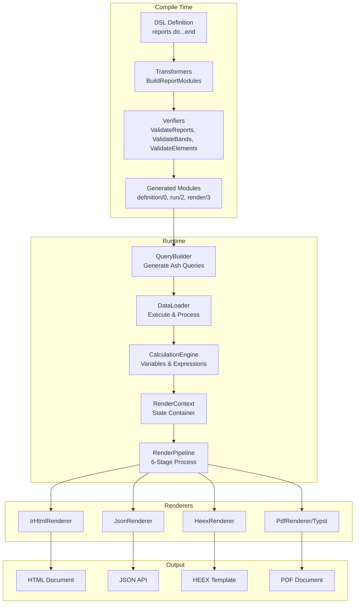
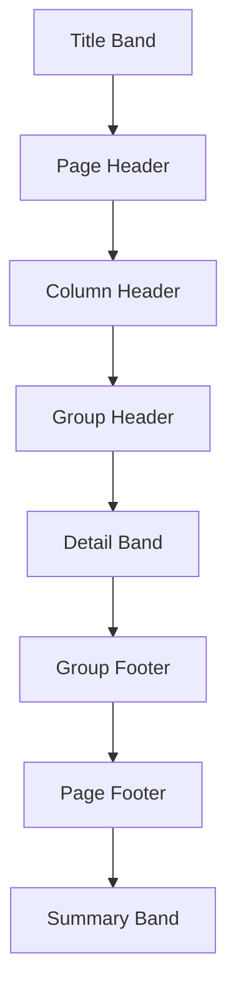
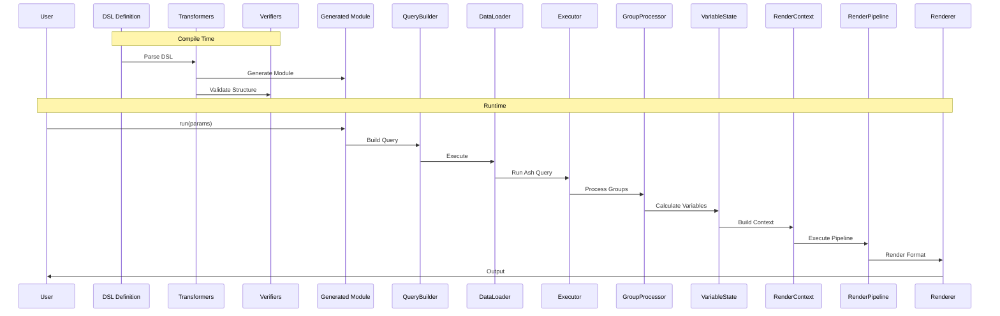
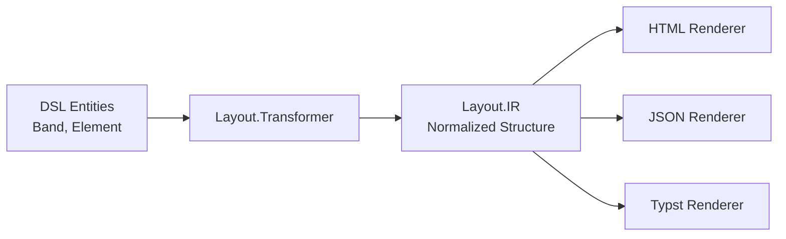
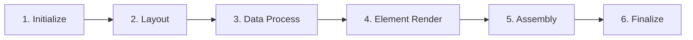
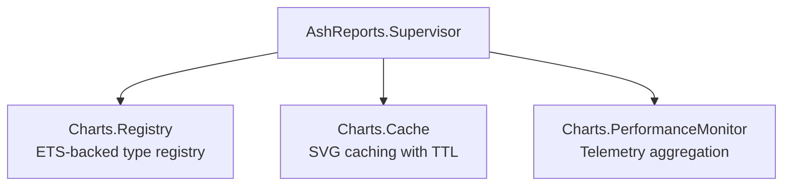

# Architecture Overview

This guide provides a comprehensive overview of the AshReports architecture, explaining how the major components work together to transform declarative report definitions into rendered output.

## Table of Contents

- [System Architecture](#system-architecture)
- [Core Concepts](#core-concepts)
- [Data Flow](#data-flow)
- [Directory Structure](#directory-structure)
- [Design Patterns](#design-patterns)
- [Integration with Ash Framework](#integration-with-ash-framework)

## System Architecture

AshReports is built as a Spark DSL extension for the Ash Framework. It provides a declarative way to define reports that query Ash resources and render them to multiple output formats.



### Component Overview

| Component | Responsibility | Key Files |
|-----------|---------------|-----------|
| **DSL** | Declarative report definitions | `lib/ash_reports/dsl.ex` |
| **Extension** | Spark DSL integration | `lib/ash_reports.ex`, `lib/ash_reports/reports/domain.ex` |
| **Transformers** | Generate runtime modules | `lib/ash_reports/transformers/` |
| **Verifiers** | Compile-time validation | `lib/ash_reports/verifiers/` |
| **QueryBuilder** | Generate Ash queries | `lib/ash_reports/query_builder.ex` |
| **DataLoader** | Data fetching & processing | `lib/ash_reports/data_loader/` |
| **Renderers** | Format-specific output | `lib/ash_reports/renderers/` |
| **Charts** | Visualization generation | `lib/ash_reports/charts/` |
| **Layout** | Positioning & IR | `lib/ash_reports/layout/` |

## Core Concepts

### Reports

A **Report** is the top-level entity that defines what data to fetch and how to present it.

```elixir
report :sales_report do
  title "Monthly Sales Report"
  driving_resource MyApp.Sales.Order

  parameters do
    parameter :start_date, :date, required: true
    parameter :end_date, :date, required: true
  end

  bands do
    # Report structure...
  end
end
```

Key attributes:
- `driving_resource` - The primary Ash resource to query
- `parameters` - Runtime inputs with validation
- `bands` - Hierarchical structure of the report
- `variables` - Accumulators (sum, count, avg, min, max)
- `groups` - Data grouping definitions

### Bands

**Bands** are horizontal sections that make up the report structure. They are processed in a specific order:



| Band Type | Occurrence | Purpose |
|-----------|------------|---------|
| `title` | Once at start | Report title and metadata |
| `page_header` | Each page | Running header |
| `column_header` | Once or per page | Column labels |
| `group_header` | Per group start | Group identification |
| `detail` | Per record | Main data rows |
| `group_footer` | Per group end | Group summaries |
| `page_footer` | Each page | Page numbers, etc. |
| `summary` | Once at end | Report totals |

### Elements

**Elements** are the content within bands. AshReports supports 13 element types:

| Category | Elements | Purpose |
|----------|----------|---------|
| **Data** | `field`, `expression`, `aggregate` | Display data values |
| **Text** | `label` | Static text |
| **Visual** | `line`, `box`, `image` | Visual elements |
| **Charts** | `bar_chart`, `line_chart`, `pie_chart`, `area_chart`, `scatter_chart`, `gantt_chart`, `sparkline` | Visualizations |

### Variables

**Variables** accumulate values across report execution:

```elixir
variable :total_sales do
  type :sum
  expression expr(amount)
  reset_on :group  # or :page, :report
end
```

Types: `:sum`, `:count`, `:average`, `:min`, `:max`, `:custom`

### Groups

**Groups** organize data hierarchically:

```elixir
group :by_region do
  expression expr(region)
  sort_direction :asc
end
```

## Data Flow

The complete data flow from DSL definition to rendered output:



### Phase Breakdown

**Phase 1: Compile Time**
1. DSL is parsed by Spark framework
2. `BuildReportModules` transformer generates a module per report
3. Verifiers validate structure (unique names, required fields, band ordering)
4. Generated module provides `definition/0`, `run/2`, `render/3`

**Phase 2: Query Building**
1. Parameters are validated against definitions
2. QueryBuilder generates Ash query from report definition
3. Filters, sorts, and relationships are applied
4. Scopes and pagination configured

**Phase 3: Data Loading**
1. Executor runs Ash query (with streaming for large datasets)
2. GroupProcessor detects group breaks
3. VariableState calculates accumulators
4. Results cached for performance

**Phase 4: Rendering**
1. RenderContext assembled with data and config
2. RenderPipeline executes 6 stages
3. Format-specific renderer produces output
4. Metadata and timing captured

## Directory Structure

```
lib/ash_reports/
├── ash_reports.ex              # Main extension entry point
├── dsl.ex                      # DSL entity definitions (2,652 lines)
├── info.ex                     # Introspection via Spark.InfoGenerator
├── runner.ex                   # Report execution orchestration
├── query_builder.ex            # Ash query generation
├── application.ex              # Supervision tree
│
├── reports/                    # Core domain structures
│   ├── report.ex               # Report struct
│   ├── band.ex                 # Band hierarchy
│   ├── element.ex              # Element base
│   ├── element/                # 13 element types
│   ├── parameter.ex            # Runtime parameters
│   ├── variable.ex             # Accumulator variables
│   ├── group.ex                # Grouping definitions
│   └── domain.ex               # Domain extension
│
├── transformers/               # Compile-time processing
│   └── build_report_modules.ex
│
├── verifiers/                  # Compile-time validation
│   ├── validate_reports.ex
│   ├── validate_bands.ex
│   └── validate_elements.ex
│
├── data_loader/                # Data loading system
│   ├── data_loader.ex          # Orchestration
│   ├── executor.ex             # Query execution
│   ├── pipeline.ex             # Stream processing
│   ├── group_processor.ex      # Group handling
│   └── cache.ex                # Result caching
│
├── renderers/                  # Output renderers
│   ├── renderer.ex             # Behaviour definition
│   ├── render_context.ex       # State container
│   ├── render_pipeline.ex      # 6-stage pipeline
│   ├── ir_html_renderer.ex     # HTML output
│   ├── json_renderer/          # JSON API
│   ├── heex_renderer/          # Phoenix templates
│   └── pdf_renderer.ex         # PDF output
│
├── layout/                     # Layout system
│   ├── ir.ex                   # Intermediate representation
│   ├── grid.ex                 # CSS Grid layout
│   ├── table.ex                # Table layout
│   ├── stack.ex                # Flexbox-like layout
│   └── transformer.ex          # DSL to IR
│
├── charts/                     # Chart system
│   ├── charts.ex               # Main API
│   ├── registry.ex             # Type registry (GenServer)
│   ├── cache.ex                # SVG cache (GenServer)
│   ├── performance_monitor.ex  # Metrics (GenServer)
│   ├── types/                  # 7 chart implementations
│   └── configs/                # Ecto schema configs
│
├── engines/                    # Calculation engines
│   ├── calculation_engine.ex   # Expression evaluation
│   └── layout_engine.ex        # Positioning
│
├── typst/                      # PDF generation
│   ├── dsl_generator.ex        # DSL to Typst
│   ├── chart_embedder.ex       # SVG embedding
│   └── data_processor.ex       # Data conversion
│
└── live_view/                  # Phoenix LiveView
    ├── dashboard_live.ex       # Dashboard component
    └── chart_live_component.ex # Chart component
```

## Design Patterns

### 1. Spark DSL Extension

AshReports uses the Spark framework for declarative DSL:

```elixir
use Spark.Dsl.Extension,
  sections: [@reports_section],
  transformers: [AshReports.Transformers.BuildReportModules],
  verifiers: [
    AshReports.Verifiers.ValidateReports,
    AshReports.Verifiers.ValidateBands,
    AshReports.Verifiers.ValidateElements
  ]
```

This provides:
- Declarative syntax via macros
- Compile-time validation
- Introspection via `Spark.InfoGenerator`
- Module generation via transformers

### 2. Intermediate Representation (IR)

Layouts are normalized to IR before rendering:



Benefits:
- Single source of truth for layout
- Format-agnostic positioning
- Consistent output across renderers

### 3. Context-Based Rendering

`RenderContext` carries complete state through the pipeline:

```elixir
%RenderContext{
  report: Report.t(),
  data_result: map(),
  config: RenderConfig.t(),
  current_record: map(),
  current_band: Band.t(),
  variables: map(),
  locale: String.t(),
  errors: [map()]
}
```

Benefits:
- Immutable state management
- Easy testing
- Clear data flow

### 4. Pipeline Architecture

The `RenderPipeline` uses a 6-stage process:



### 5. GenServer Infrastructure

Charts use three GenServers for runtime services:



## Integration with Ash Framework

AshReports integrates deeply with Ash:

### Resource Queries

```elixir
# Report definition
driving_resource MyApp.Sales.Order

# Generated query uses Ash
Ash.Query.new(Order)
|> Ash.Query.filter(^filter_expr)
|> Ash.Query.sort(^sort_expr)
|> Ash.Query.load(^relationships)
|> Ash.read!(domain)
```

### Domain Extension

```elixir
defmodule MyApp.Reporting do
  use Ash.Domain,
    extensions: [AshReports.Domain]

  reports do
    report :sales_report do
      # ...
    end
  end
end
```

### Expressions

Report expressions use Ash.Expr:

```elixir
variable :margin do
  expression expr(revenue - cost)
end

field :formatted_date do
  source :created_at
  format :date
end
```

### Streaming

Large datasets use `Ash.stream!` for memory efficiency:

```elixir
Order
|> Ash.Query.for_read(:list)
|> Ash.stream!(domain, batch_size: 100)
|> Stream.each(&process_record/1)
```

## Next Steps

- [DSL System](dsl-system.md) - Deep dive into the DSL architecture
- [Data Loading Pipeline](data-loading.md) - How data is fetched and processed
- [Rendering System](rendering-system.md) - The rendering pipeline
