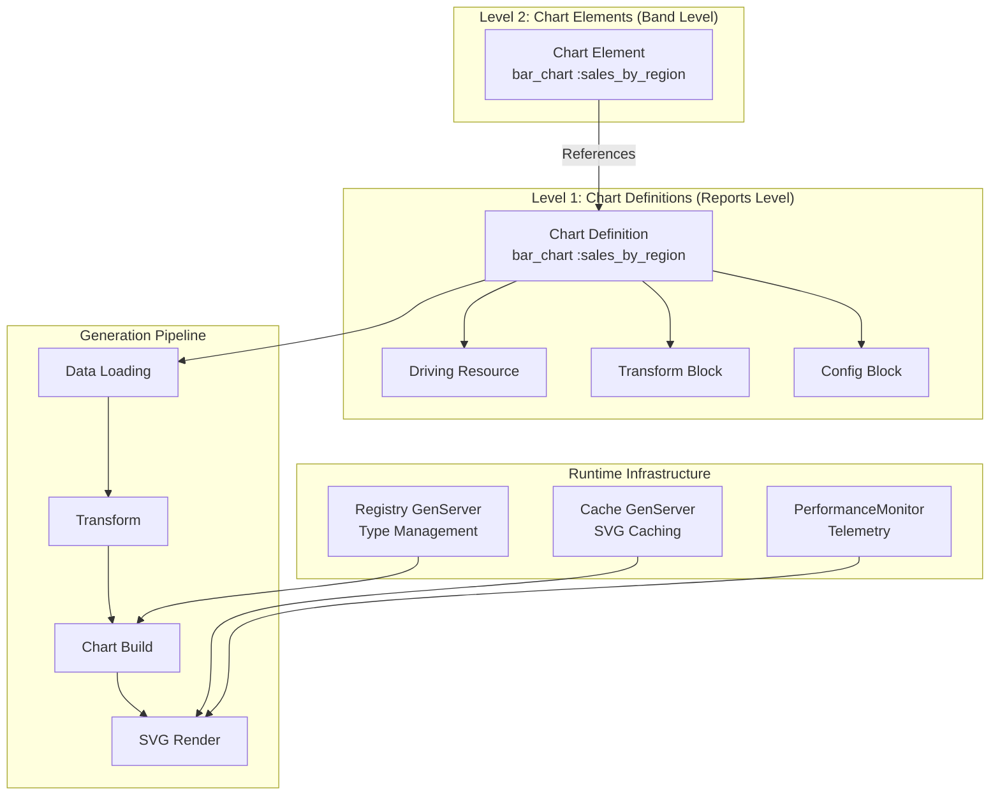
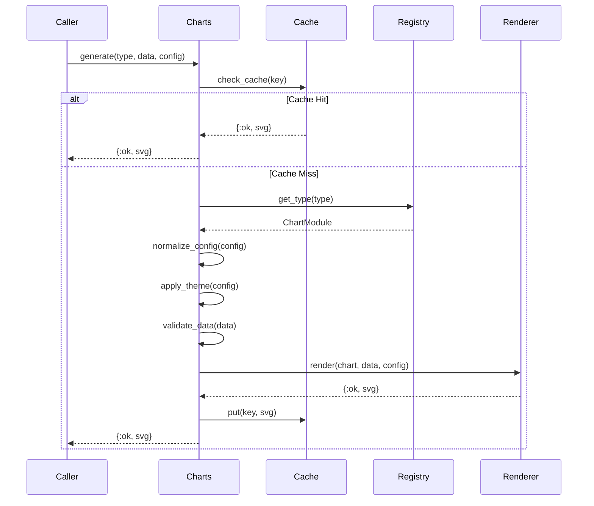
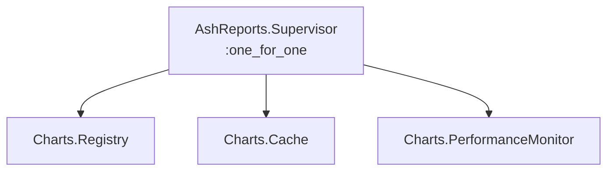

# Chart System

This guide explains the AshReports chart architecture, including chart types, the generation pipeline, and supporting infrastructure.

## Table of Contents

- [Architecture Overview](#architecture-overview)
- [Chart Types](#chart-types)
- [Chart Behaviour](#chart-behaviour)
- [Configuration System](#configuration-system)
- [Generation Pipeline](#generation-pipeline)
- [GenServer Infrastructure](#genserver-infrastructure)
- [Transform DSL](#transform-dsl)
- [Contex Integration](#contex-integration)

## Architecture Overview

AshReports uses a two-level architecture for charts:



### Benefits

- **Reusable**: Charts defined once, used in multiple bands
- **Testable**: Chart logic independent of rendering
- **Cacheable**: SVG output cached by data signature

## Chart Types

Location: `lib/ash_reports/charts/types/`

AshReports supports 7 chart types:

| Type | Module | Use Case |
|------|--------|----------|
| Bar Chart | `BarChart` | Comparing categories |
| Line Chart | `LineChart` | Trends over time |
| Pie Chart | `PieChart` | Proportions |
| Area Chart | `AreaChart` | Cumulative values |
| Scatter Plot | `ScatterPlot` | Correlation |
| Gantt Chart | `GanttChart` | Timelines |
| Sparkline | `Sparkline` | Inline trends |

### Bar Chart

```elixir
defmodule AshReports.Charts.Types.BarChart do
  @behaviour AshReports.Charts.Types.Behavior

  @impl true
  def build(data, config) do
    dataset = Contex.Dataset.new(data, ["category", "value"])

    Contex.BarChart.new(dataset)
    |> Contex.BarChart.type(config.type)  # :simple, :grouped, :stacked
    |> Contex.BarChart.orientation(config.orientation)
    |> Contex.BarChart.data_labels(config.data_labels)
    |> Contex.BarChart.padding(config.padding)
    |> apply_colours(config.colours)
  end

  @impl true
  def validate(data) do
    with :ok <- validate_category_value_format(data) do
      :ok
    end
  end
end
```

### Line Chart

```elixir
defmodule AshReports.Charts.Types.LineChart do
  @behaviour AshReports.Charts.Types.Behavior

  @impl true
  def build(data, config) do
    dataset = Contex.Dataset.new(data, ["x", "y"])

    Contex.LinePlot.new(dataset)
    |> Contex.LinePlot.smoothed(config.smoothed)
    |> apply_colours(config.colours)
  end
end
```

### Pie Chart

```elixir
defmodule AshReports.Charts.Types.PieChart do
  @impl true
  def build(data, config) do
    dataset = Contex.Dataset.new(data, ["label", "value"])

    Contex.PieChart.new(dataset)
    |> Contex.PieChart.colours(config.colours)
  end
end
```

## Chart Behaviour

Location: `lib/ash_reports/charts/types/behavior.ex`

All chart types implement this behaviour:

```elixir
defmodule AshReports.Charts.Types.Behavior do
  @callback build(data :: list(map()), config :: struct()) ::
    {:ok, Contex.chart()} | {:error, term()}

  @callback validate(data :: list(map())) ::
    :ok | {:error, term()}
end
```

### Implementing Custom Chart Type

```elixir
defmodule MyApp.Charts.CustomChart do
  @behaviour AshReports.Charts.Types.Behavior

  @impl true
  def build(data, config) do
    # Build custom chart using Contex or other library
    chart = build_custom_chart(data, config)
    {:ok, chart}
  end

  @impl true
  def validate(data) do
    # Validate data format
    case validate_data_format(data) do
      true -> :ok
      false -> {:error, "Invalid data format"}
    end
  end
end
```

## Configuration System

Location: `lib/ash_reports/charts/configs/`

Each chart type has an Ecto schema for configuration:

### Bar Chart Config

```elixir
defmodule AshReports.Charts.Configs.BarChartConfig do
  use Ecto.Schema

  embedded_schema do
    field :width, :integer, default: 600
    field :height, :integer, default: 400
    field :title, :string
    field :type, Ecto.Enum, values: [:simple, :grouped, :stacked], default: :simple
    field :orientation, Ecto.Enum, values: [:vertical, :horizontal], default: :vertical
    field :data_labels, :boolean, default: true
    field :padding, :integer, default: 2
    field :colours, {:array, :string}, default: []
  end
end
```

### Line Chart Config

```elixir
defmodule AshReports.Charts.Configs.LineChartConfig do
  use Ecto.Schema

  embedded_schema do
    field :width, :integer, default: 600
    field :height, :integer, default: 400
    field :title, :string
    field :smoothed, :boolean, default: true
    field :stroke_width, :string, default: "2"
    field :colours, {:array, :string}, default: []
    field :axis_label_rotation, Ecto.Enum, values: [:auto, :"45", :"90"], default: :auto
  end
end
```

### Config Validation

```elixir
def validate_config(config_struct) do
  config_struct
  |> Ecto.Changeset.change()
  |> Ecto.Changeset.validate_number(:width, greater_than: 0)
  |> Ecto.Changeset.validate_number(:height, greater_than: 0)
  |> validate_colours()
end
```

## Generation Pipeline

Location: `lib/ash_reports/charts/charts.ex`

### Pipeline Flow



### Main API

```elixir
defmodule AshReports.Charts do
  def generate(type, data, config, opts \\ []) do
    cache_enabled = Keyword.get(opts, :cache, true)
    cache_key = generate_cache_key(type, data, config)

    if cache_enabled do
      case Cache.get(cache_key) do
        {:ok, svg} -> {:ok, svg}
        :miss -> generate_and_cache(type, data, config, cache_key)
      end
    else
      do_generate(type, data, config)
    end
  end

  defp do_generate(type, data, config) do
    with {:ok, chart_module} <- Registry.get(type),
         config <- normalize_config(config, type),
         config <- Theme.apply(config),
         :ok <- chart_module.validate(data),
         {:ok, chart} <- chart_module.build(data, config),
         {:ok, svg} <- Renderer.render(chart, config) do
      emit_telemetry(:chart_generated, %{type: type})
      {:ok, svg}
    end
  end
end
```

### Renderer

Location: `lib/ash_reports/charts/renderer.ex`

```elixir
defmodule AshReports.Charts.Renderer do
  def render(chart, config) do
    plot =
      Contex.Plot.new(config.width, config.height, chart)
      |> Contex.Plot.titles(config.title, nil)
      |> Contex.Plot.plot_options(%{})

    svg = Contex.Plot.to_svg(plot)
    optimized = optimize_svg(svg)

    {:ok, optimized}
  end

  defp optimize_svg(svg) do
    svg
    |> String.replace(~r/\s+/, " ")
    |> String.trim()
  end
end
```

## GenServer Infrastructure

### Supervision Tree



### Registry

Location: `lib/ash_reports/charts/registry.ex`

```elixir
defmodule AshReports.Charts.Registry do
  use GenServer

  @table :ash_reports_chart_registry

  def start_link(_opts) do
    GenServer.start_link(__MODULE__, [], name: __MODULE__)
  end

  def init(_) do
    table = :ets.new(@table, [:named_table, :public, read_concurrency: true])
    register_defaults()
    {:ok, %{table: table}}
  end

  defp register_defaults do
    [
      {:bar_chart, AshReports.Charts.Types.BarChart},
      {:line_chart, AshReports.Charts.Types.LineChart},
      {:pie_chart, AshReports.Charts.Types.PieChart},
      {:area_chart, AshReports.Charts.Types.AreaChart},
      {:scatter_chart, AshReports.Charts.Types.ScatterPlot},
      {:gantt_chart, AshReports.Charts.Types.GanttChart},
      {:sparkline, AshReports.Charts.Types.Sparkline}
    ]
    |> Enum.each(fn {type, module} -> register(type, module) end)
  end

  def register(type, module) do
    :ets.insert(@table, {type, module})
  end

  def get(type) do
    case :ets.lookup(@table, type) do
      [{^type, module}] -> {:ok, module}
      [] -> {:error, :unknown_chart_type}
    end
  end

  def list do
    :ets.tab2list(@table)
    |> Enum.map(fn {type, _module} -> type end)
  end
end
```

### Cache

Location: `lib/ash_reports/charts/cache.ex`

```elixir
defmodule AshReports.Charts.Cache do
  use GenServer

  @table :ash_reports_chart_cache
  @stats_table :ash_reports_cache_stats
  @default_ttl :timer.minutes(5)
  @cleanup_interval :timer.seconds(60)
  @max_entries 1000
  @compression_threshold 10_000

  def start_link(_opts) do
    GenServer.start_link(__MODULE__, [], name: __MODULE__)
  end

  def init(_) do
    :ets.new(@table, [:named_table, :public, read_concurrency: true])
    :ets.new(@stats_table, [:named_table, :public])
    :ets.insert(@stats_table, {:hits, 0})
    :ets.insert(@stats_table, {:misses, 0})

    schedule_cleanup()
    {:ok, %{}}
  end

  def get(key) do
    case :ets.lookup(@table, key) do
      [{^key, svg, expires_at, _last_accessed}]
        when expires_at > :erlang.system_time(:millisecond) ->
        update_last_accessed(key)
        increment_hits()
        {:ok, decompress_if_needed(svg)}

      _ ->
        increment_misses()
        :miss
    end
  end

  def put(key, svg, ttl \\ @default_ttl) do
    expires_at = :erlang.system_time(:millisecond) + ttl
    last_accessed = :erlang.system_time(:millisecond)

    svg_data = compress_if_large(svg)
    :ets.insert(@table, {key, svg_data, expires_at, last_accessed})

    maybe_evict()
    :ok
  end

  defp compress_if_large(svg) when byte_size(svg) > @compression_threshold do
    {:compressed, :zlib.gzip(svg)}
  end
  defp compress_if_large(svg), do: {:uncompressed, svg}

  defp decompress_if_needed({:compressed, data}), do: :zlib.gunzip(data)
  defp decompress_if_needed({:uncompressed, svg}), do: svg

  defp maybe_evict do
    if :ets.info(@table, :size) > @max_entries do
      evict_oldest(div(@max_entries, 10))
    end
  end

  def stats do
    [{:hits, hits}] = :ets.lookup(@stats_table, :hits)
    [{:misses, misses}] = :ets.lookup(@stats_table, :misses)
    total = hits + misses
    hit_rate = if total > 0, do: hits / total, else: 0.0

    %{
      hits: hits,
      misses: misses,
      hit_rate: hit_rate,
      size: :ets.info(@table, :size)
    }
  end
end
```

### PerformanceMonitor

Location: `lib/ash_reports/charts/performance_monitor.ex`

```elixir
defmodule AshReports.Charts.PerformanceMonitor do
  use GenServer

  @table :ash_reports_performance_metrics

  def start_link(_opts) do
    GenServer.start_link(__MODULE__, [], name: __MODULE__)
  end

  def init(_) do
    :ets.new(@table, [:named_table, :public])
    attach_telemetry_handlers()
    {:ok, %{}}
  end

  defp attach_telemetry_handlers do
    :telemetry.attach_many(
      "ash-reports-charts",
      [
        [:ash_reports, :chart, :generate, :start],
        [:ash_reports, :chart, :generate, :stop],
        [:ash_reports, :chart, :cache, :hit],
        [:ash_reports, :chart, :cache, :miss]
      ],
      &handle_event/4,
      nil
    )
  end

  def handle_event([:ash_reports, :chart, :generate, :stop], measurements, _metadata, _config) do
    update_metric(:total_generated, 1)
    update_metric(:total_generation_time, measurements.duration)
  end

  def handle_event([:ash_reports, :chart, :cache, :hit], _measurements, _metadata, _config) do
    update_metric(:cache_hits, 1)
  end

  def metrics do
    %{
      total_generated: get_metric(:total_generated),
      avg_generation_time: calculate_avg_time(),
      cache_hit_rate: calculate_hit_rate()
    }
  end
end
```

## Transform DSL

Location: `lib/ash_reports/charts/transform_dsl.ex`

Transform DSL specifies how to aggregate and map data:

```elixir
defmodule AshReports.Charts.TransformDSL do
  defstruct [
    :group_by,
    :aggregates,
    :filters,
    :sort_by,
    :limit,
    :as_category,
    :as_value,
    :as_x,
    :as_y,
    :as_task,
    :as_start_date,
    :as_end_date,
    :as_values
  ]

  def to_transform(dsl) do
    %AshReports.Charts.Transform{
      group_by: dsl.group_by,
      aggregates: parse_aggregates(dsl.aggregates),
      filters: dsl.filters,
      sort_by: dsl.sort_by,
      limit: dsl.limit,
      field_mapping: build_field_mapping(dsl)
    }
  end

  defp build_field_mapping(dsl) do
    %{
      category: dsl.as_category,
      value: dsl.as_value,
      x: dsl.as_x,
      y: dsl.as_y,
      task: dsl.as_task,
      start_date: dsl.as_start_date,
      end_date: dsl.as_end_date,
      values: dsl.as_values
    }
    |> Enum.reject(fn {_k, v} -> is_nil(v) end)
    |> Map.new()
  end
end
```

### DSL Usage

```elixir
bar_chart :sales_by_region do
  driving_resource MyApp.Sales.Order

  transform do
    group_by :region
    as_category :group_key
    as_value :total

    aggregates do
      aggregate type: :sum, field: :amount, as: :total
      aggregate type: :count, as: :count
    end

    sort_by {:total, :desc}
    limit 10
  end

  config do
    width 800
    height 400
    title "Top 10 Regions by Sales"
    colours ["4285F4", "34A853", "FBBC04"]
  end
end
```

## Contex Integration

AshReports uses [Contex](https://hexdocs.pm/contex) for SVG chart generation.

### Supported Contex Charts

| AshReports Type | Contex Module |
|-----------------|---------------|
| Bar Chart | `Contex.BarChart` |
| Line Chart | `Contex.LinePlot` |
| Pie Chart | `Contex.PieChart` |
| Area Chart | Custom on `Contex.LinePlot` |
| Scatter Plot | `Contex.PointPlot` |
| Gantt Chart | `Contex.GanttChart` |
| Sparkline | `Contex.Sparkline` |

### Building with Contex

```elixir
def build_bar_chart(data, config) do
  # Create dataset
  dataset = Contex.Dataset.new(data, ["category", "value"])

  # Create chart
  chart =
    Contex.BarChart.new(dataset)
    |> Contex.BarChart.type(:simple)
    |> Contex.BarChart.colours(:default)

  # Create plot
  plot =
    Contex.Plot.new(config.width, config.height, chart)
    |> Contex.Plot.titles(config.title, nil)

  # Generate SVG
  Contex.Plot.to_svg(plot)
end
```

## Usage Examples

### Generate Chart Programmatically

```elixir
# Generate bar chart
{:ok, svg} = AshReports.Charts.generate(
  :bar_chart,
  [
    %{category: "North", value: 1500},
    %{category: "South", value: 1200},
    %{category: "East", value: 1800}
  ],
  %{
    width: 600,
    height: 400,
    title: "Sales by Region",
    colours: ["4285F4", "34A853", "FBBC04"]
  }
)
```

### Register Custom Chart Type

```elixir
# Register at application start
AshReports.Charts.Registry.register(:custom_chart, MyApp.Charts.CustomChart)

# Use in DSL
custom_chart :my_custom do
  driving_resource MyApp.Resource
  # ...
end
```

## Next Steps

- [PDF Generation](typst-pdf-generation.md) - Chart embedding in PDFs
- [Extending AshReports](extending-ash-reports.md) - Custom chart types
