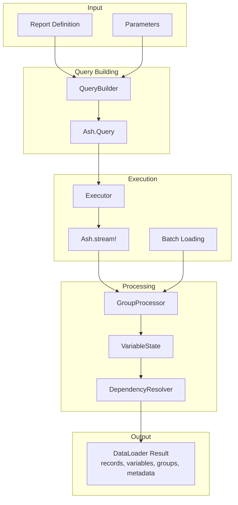
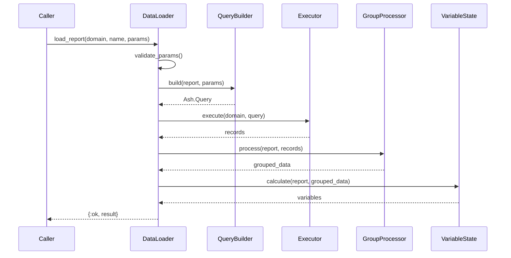
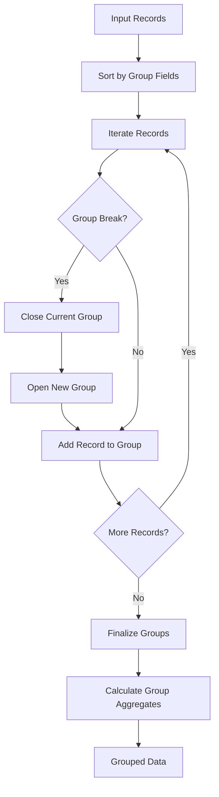
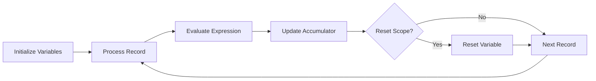
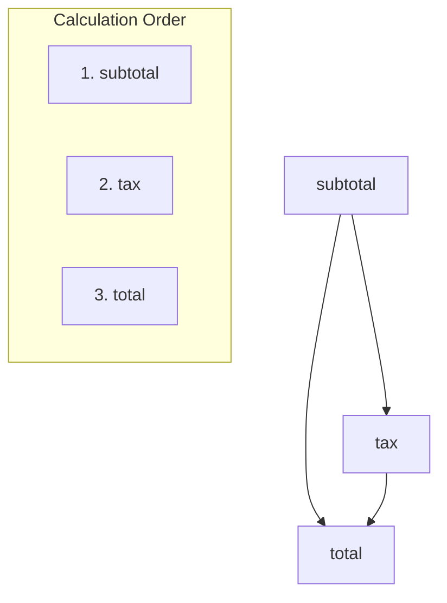

# Data Loading Pipeline

This guide explains how AshReports fetches and processes data from Ash resources, including query building, execution, grouping, and variable calculation.

## Table of Contents

- [Pipeline Overview](#pipeline-overview)
- [QueryBuilder](#querybuilder)
- [DataLoader](#dataloader)
- [Executor](#executor)
- [GroupProcessor](#groupprocessor)
- [VariableState](#variablestate)
- [DependencyResolver](#dependencyresolver)
- [Caching and Performance](#caching-and-performance)

## Pipeline Overview

The data loading pipeline transforms a report definition and parameters into processed data ready for rendering:



### DataLoader Result Structure

```elixir
%{
  records: [%{field1: val1, ...}, ...],      # Processed records
  variables: %{total: 1000, count: 10, ...}, # Calculated variables
  groups: %{                                   # Grouped data
    "Region A" => %{
      records: [...],
      aggregates: %{sum: 500, count: 5}
    },
    "Region B" => %{...}
  },
  metadata: %{                                 # Performance metrics
    record_count: 100,
    processing_time_ms: 150,
    cache_hit: false
  }
}
```

## QueryBuilder

Location: `lib/ash_reports/query_builder.ex`

QueryBuilder generates Ash queries from report definitions.

### Building Queries

```elixir
defmodule AshReports.QueryBuilder do
  def build(report, params) do
    report.driving_resource
    |> Ash.Query.new()
    |> apply_base_filter(report, params)
    |> apply_parameter_filters(report, params)
    |> apply_sorts(report)
    |> apply_loads(report)
    |> apply_pagination(report, params)
  end
end
```

### Base Filter

The report's `base_filter` is a function that receives params:

```elixir
# In report definition
base_filter(fn params ->
  import Ash.Query
  MyApp.Order
  |> filter(status == :completed)
  |> filter(created_at >= ^params[:start_date])
end)

# QueryBuilder applies it
defp apply_base_filter(query, report, params) do
  case report.base_filter do
    nil -> query
    filter_fn -> filter_fn.(params)
  end
end
```

### Parameter Filters

Parameters can define filters:

```elixir
parameter :region, :string do
  filter expr(region == ^value)
end

# Applied in QueryBuilder
defp apply_parameter_filters(query, report, params) do
  Enum.reduce(report.parameters, query, fn param, q ->
    case Map.get(params, param.name) do
      nil -> q
      value -> apply_param_filter(q, param, value)
    end
  end)
end
```

### Relationship Loading

```elixir
defp apply_loads(query, report) do
  loads = extract_required_loads(report)
  Ash.Query.load(query, loads)
end

defp extract_required_loads(report) do
  report.bands
  |> Enum.flat_map(&extract_band_loads/1)
  |> Enum.uniq()
end
```

## DataLoader

Location: `lib/ash_reports/data_loader/data_loader.ex`

DataLoader orchestrates the complete data loading process.

### Main API

```elixir
defmodule AshReports.DataLoader do
  def load_report(domain, report_name, params, opts \\ []) do
    with {:ok, report} <- get_report(domain, report_name),
         {:ok, params} <- validate_params(report, params),
         {:ok, query} <- build_query(report, params),
         {:ok, data} <- execute_query(domain, query, opts),
         {:ok, grouped} <- process_groups(report, data),
         {:ok, variables} <- calculate_variables(report, grouped) do
      {:ok, build_result(data, grouped, variables)}
    end
  end
end
```

### Pipeline Stages



## Executor

Location: `lib/ash_reports/data_loader/executor.ex`

Executor handles query execution with streaming support.

### Standard Execution

```elixir
defmodule AshReports.DataLoader.Executor do
  def execute(domain, query, opts \\ []) do
    case Keyword.get(opts, :stream, false) do
      false -> execute_batch(domain, query)
      true -> execute_stream(domain, query, opts)
    end
  end

  defp execute_batch(domain, query) do
    case Ash.read(query, domain: domain) do
      {:ok, records} -> {:ok, records}
      {:error, error} -> {:error, error}
    end
  end
end
```

### Streaming Execution

For large datasets, streaming uses `Ash.stream!`:

```elixir
defp execute_stream(domain, query, opts) do
  batch_size = Keyword.get(opts, :batch_size, 100)

  stream =
    query
    |> Ash.Query.for_read(:read)
    |> Ash.stream!(domain, batch_size: batch_size)

  {:ok, stream}
end
```

### Batch Loading Relationships

```elixir
def load_relationships(records, loads, domain) do
  records
  |> Enum.chunk_every(100)
  |> Enum.flat_map(fn batch ->
    Ash.load!(batch, loads, domain: domain)
  end)
end
```

## GroupProcessor

Location: `lib/ash_reports/data_loader/group_processor.ex`

GroupProcessor organizes records into groups based on report group definitions.

### Group Processing Flow



### Implementation

```elixir
defmodule AshReports.DataLoader.GroupProcessor do
  def process(report, records) do
    case report.groups do
      [] -> {:ok, %{default: %{records: records}}}
      groups -> process_groups(records, groups)
    end
  end

  defp process_groups(records, groups) do
    sorted = sort_by_groups(records, groups)

    {grouped, _} =
      Enum.reduce(sorted, {%{}, nil}, fn record, {acc, prev_key} ->
        key = extract_group_key(record, groups)

        if key != prev_key do
          # Group break detected
          acc = close_group(acc, prev_key)
          acc = open_group(acc, key)
          {add_to_group(acc, key, record), key}
        else
          {add_to_group(acc, key, record), key}
        end
      end)

    {:ok, calculate_group_aggregates(grouped)}
  end
end
```

### Multi-Level Grouping

```elixir
# Report with nested groups
groups do
  group :by_region do
    expression expr(region)
    level 1
  end

  group :by_product do
    expression expr(product_category)
    level 2
  end
end

# Results in nested structure
%{
  "North" => %{
    records: [...],
    subgroups: %{
      "Electronics" => %{records: [...], aggregates: %{}},
      "Clothing" => %{records: [...], aggregates: %{}}
    },
    aggregates: %{sum: 1000, count: 50}
  }
}
```

## VariableState

Location: `lib/ash_reports/reports/variable_state.ex`

VariableState manages accumulator variables during report execution.

### Variable Types

| Type | Calculation | Initial |
|------|-------------|---------|
| `:sum` | Running total | 0 |
| `:count` | Record count | 0 |
| `:average` | Running average | {0, 0} (sum, count) |
| `:min` | Minimum value | nil |
| `:max` | Maximum value | nil |
| `:custom` | User function | configurable |

### Calculation Flow



### Implementation

```elixir
defmodule AshReports.VariableState do
  defstruct [:variables, :values, :scope_stack]

  def new(report) do
    variables = report.variables
    values = initialize_values(variables)
    %__MODULE__{variables: variables, values: values, scope_stack: []}
  end

  def process_record(state, record, scope_context) do
    state
    |> check_scope_resets(scope_context)
    |> update_variables(record)
  end

  defp update_variables(state, record) do
    Enum.reduce(state.variables, state, fn var, acc ->
      value = evaluate_expression(var.expression, record)
      update_accumulator(acc, var, value)
    end)
  end

  defp update_accumulator(state, %{type: :sum, name: name}, value) do
    current = Map.get(state.values, name, 0)
    put_value(state, name, current + value)
  end

  defp update_accumulator(state, %{type: :count, name: name}, _value) do
    current = Map.get(state.values, name, 0)
    put_value(state, name, current + 1)
  end

  defp update_accumulator(state, %{type: :average, name: name}, value) do
    {sum, count} = Map.get(state.values, name, {0, 0})
    put_value(state, name, {sum + value, count + 1})
  end
end
```

### Scope Resets

Variables reset based on their `reset_on` setting:

```elixir
defp check_scope_resets(state, %{scope_change: :group, group_level: level}) do
  Enum.reduce(state.variables, state, fn var, acc ->
    if var.reset_on == :group and var.group_level <= level do
      reset_variable(acc, var)
    else
      acc
    end
  end)
end
```

## DependencyResolver

Location: `lib/ash_reports/dependency_resolver.ex`

DependencyResolver performs topological sort on variable dependencies.

### Why Dependency Resolution?

Variables can depend on other variables:

```elixir
variable :subtotal do
  type :sum
  expression expr(quantity * unit_price)
end

variable :tax do
  type :custom
  expression expr(subtotal * 0.1)  # Depends on subtotal
end

variable :total do
  type :custom
  expression expr(subtotal + tax)  # Depends on subtotal and tax
end
```

### Topological Sort



### Implementation

```elixir
defmodule AshReports.DependencyResolver do
  def resolve(variables) do
    graph = build_dependency_graph(variables)
    topological_sort(graph)
  end

  defp build_dependency_graph(variables) do
    Enum.reduce(variables, %{}, fn var, graph ->
      deps = extract_dependencies(var.expression, variables)
      Map.put(graph, var.name, deps)
    end)
  end

  defp topological_sort(graph) do
    # Kahn's algorithm
    {sorted, remaining} = do_sort(graph, [], find_roots(graph))

    case map_size(remaining) do
      0 -> {:ok, sorted}
      _ -> {:error, :circular_dependency}
    end
  end
end
```

## Caching and Performance

### Result Caching

Location: `lib/ash_reports/data_loader/cache.ex`

```elixir
defmodule AshReports.DataLoader.Cache do
  use GenServer

  def get(key) do
    case :ets.lookup(@table, key) do
      [{^key, value, expires_at}] when expires_at > now() ->
        {:ok, value}
      _ ->
        :miss
    end
  end

  def put(key, value, ttl \\ @default_ttl) do
    expires_at = now() + ttl
    :ets.insert(@table, {key, value, expires_at})
    :ok
  end
end
```

### Cache Key Generation

```elixir
def cache_key(report_name, params) do
  :crypto.hash(:sha256, :erlang.term_to_binary({report_name, params}))
  |> Base.encode16()
end
```

### Performance Monitoring

Location: `lib/ash_reports/data_loader/monitor.ex`

```elixir
defmodule AshReports.DataLoader.Monitor do
  def track(operation, fun) do
    start = System.monotonic_time()
    result = fun.()
    duration = System.monotonic_time() - start

    :telemetry.execute(
      [:ash_reports, :data_loader, operation],
      %{duration: duration},
      %{}
    )

    result
  end
end
```

### Telemetry Events

| Event | Measurements | Metadata |
|-------|--------------|----------|
| `[:ash_reports, :data_loader, :query]` | duration | report_name |
| `[:ash_reports, :data_loader, :execute]` | duration, record_count | report_name |
| `[:ash_reports, :data_loader, :group]` | duration, group_count | report_name |
| `[:ash_reports, :data_loader, :variables]` | duration | report_name |
| `[:ash_reports, :data_loader, :cache_hit]` | - | report_name |
| `[:ash_reports, :data_loader, :cache_miss]` | - | report_name |

## Usage Example

```elixir
# Load report data
{:ok, result} = AshReports.DataLoader.load_report(
  MyApp.Reporting,
  :sales_report,
  %{start_date: ~D[2024-01-01], end_date: ~D[2024-12-31]},
  stream: true,
  batch_size: 500,
  cache_ttl: :timer.minutes(5)
)

# Access results
Enum.count(result.records)          # 1000
result.variables.total_sales        # Decimal.new("150000.00")
result.groups["North"].aggregates   # %{sum: 50000, count: 250}
result.metadata.processing_time_ms  # 250
```

## Next Steps

- [Rendering System](rendering-system.md) - How data is rendered
- [Layout System](layout-system.md) - Layout computation
