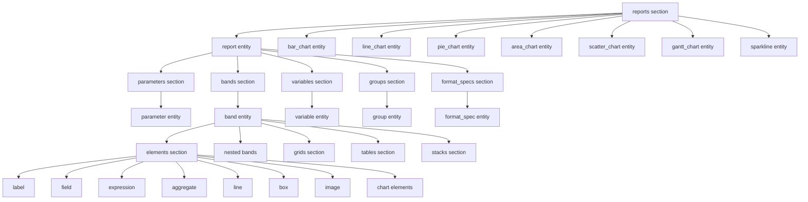
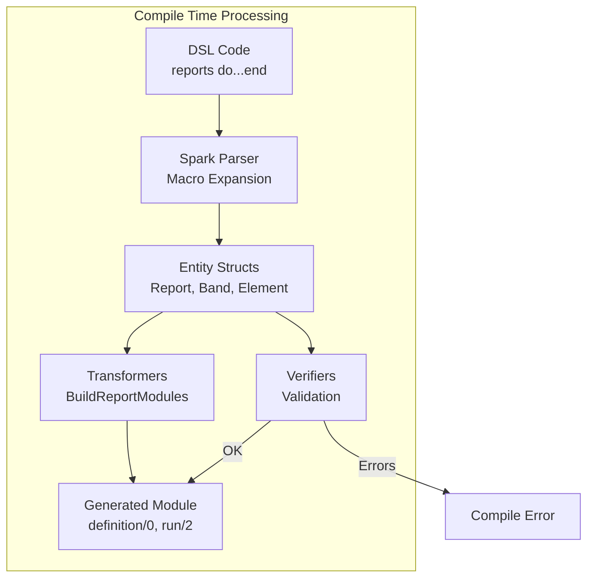

# DSL and Extension Architecture

This guide explains how the AshReports declarative DSL works, including the Spark integration, entity definitions, transformers, and verifiers.

## Table of Contents

- [Spark DSL Integration](#spark-dsl-integration)
- [DSL Entities](#dsl-entities)
- [Extension Architecture](#extension-architecture)
- [Transformers](#transformers)
- [Verifiers](#verifiers)
- [Info Module and Introspection](#info-module-and-introspection)

## Spark DSL Integration

AshReports uses the [Spark](https://hexdocs.pm/spark) framework to provide a declarative DSL. Spark enables:

- Compile-time macro expansion
- Entity and section definitions
- Automatic validation
- Introspection capabilities
- Module generation

### Extension Definition

The main extension is defined in `lib/ash_reports.ex`:

```elixir
defmodule AshReports do
  @reports_section AshReports.Dsl.reports_section()

  use Spark.Dsl.Extension,
    sections: [@reports_section],
    transformers: [
      AshReports.Transformers.BuildReportModules
    ],
    verifiers: [
      AshReports.Verifiers.ValidateReports,
      AshReports.Verifiers.ValidateBands,
      AshReports.Verifiers.ValidateElements
    ]
end
```

### Domain Extension

`AshReports.Domain` provides the same capabilities for Ash domains:

```elixir
defmodule AshReports.Domain do
  use Spark.Dsl.Extension,
    sections: [@reports_section],
    transformers: [AshReports.Transformers.BuildReportModules],
    verifiers: [
      AshReports.Verifiers.ValidateReports,
      AshReports.Verifiers.ValidateBands,
      AshReports.Verifiers.ValidateElements
    ]
end
```

Usage:

```elixir
defmodule MyApp.Reporting do
  use Ash.Domain,
    extensions: [AshReports.Domain]

  reports do
    report :sales_report do
      # ...
    end
  end
end
```

## DSL Entities

The DSL is defined in `lib/ash_reports/dsl.ex` (~2,652 lines). Here's the complete entity hierarchy:



### Report Entity

The top-level report definition:

```elixir
@report_entity %Spark.Dsl.Entity{
  name: :report,
  args: [:name],
  target: AshReports.Report,
  schema: [
    name: [type: :atom, required: true, doc: "Unique report identifier"],
    title: [type: :string, doc: "Display title"],
    description: [type: :string, doc: "Report description"],
    driving_resource: [type: :atom, required: true, doc: "Primary Ash resource"],
    base_filter: [type: {:fun, 1}, doc: "Base query filter function"],
    formats: [type: {:list, :atom}, default: [:html, :pdf, :json]],
    permissions: [type: {:list, :atom}, default: []],
    page_size: [type: :atom, default: :a4],
    orientation: [type: :atom, default: :portrait]
  ],
  entities: [
    parameters: [@parameter_entity],
    bands: [@band_entity],
    variables: [@variable_entity],
    groups: [@group_entity],
    format_specs: [@format_spec_entity]
  ]
}
```

### Parameter Entity

Runtime parameters with validation:

```elixir
@parameter_entity %Spark.Dsl.Entity{
  name: :parameter,
  args: [:name, :type],
  target: AshReports.Parameter,
  schema: [
    name: [type: :atom, required: true],
    type: [type: :atom, required: true],  # :string, :integer, :date, :datetime, etc.
    required: [type: :boolean, default: false],
    default: [type: :any],
    constraints: [type: :keyword_list, default: []],
    description: [type: :string]
  ]
}
```

Example:

```elixir
parameter :start_date, :date do
  required true
  description "Report start date"
end

parameter :limit, :integer do
  default 100
  constraints min: 1, max: 1000
end
```

### Band Entity

Hierarchical report sections:

```elixir
@band_entity %Spark.Dsl.Entity{
  name: :band,
  args: [:name],
  target: AshReports.Band,
  recursive_as: :bands,  # Allows nested bands
  schema: [
    name: [type: :atom, required: true],
    type: [
      type: {:one_of, [
        :title, :page_header, :column_header, :group_header,
        :detail, :group_footer, :page_footer, :summary,
        :background, :watermark, :no_data
      ]},
      required: true
    ],
    height: [type: :pos_integer],
    visible: [type: :boolean, default: true],
    grow: [type: :boolean, default: false],
    shrink: [type: :boolean, default: false],
    group_level: [type: :pos_integer],  # For group_header/footer
    columns: [type: :pos_integer, default: 1]
  ],
  entities: [
    elements: @element_entities,
    grids: [@grid_entity],
    tables: [@table_entity],
    stacks: [@stack_entity]
  ]
}
```

### Element Entities (13 Types)

#### Data Elements

```elixir
# Field - Display data from resource
@field_entity %Spark.Dsl.Entity{
  name: :field,
  args: [:name],
  schema: [
    name: [type: :atom, required: true],
    source: [type: :atom, required: true],  # Field on resource
    format: [type: :atom],  # :currency, :percent, :date, :datetime, :number
    format_spec: [type: :atom],  # Reference to format_spec
    style: [type: :keyword_list, default: []]
  ]
}

# Expression - Calculated values
@expression_entity %Spark.Dsl.Entity{
  name: :expression,
  args: [:name],
  schema: [
    name: [type: :atom, required: true],
    value: [type: {:fun, 1}, required: true],  # expr(...)
    format: [type: :atom],
    style: [type: :keyword_list, default: []]
  ]
}

# Aggregate - Summary calculations
@aggregate_entity %Spark.Dsl.Entity{
  name: :aggregate,
  args: [:name],
  schema: [
    name: [type: :atom, required: true],
    type: [type: {:one_of, [:sum, :count, :avg, :min, :max]}, required: true],
    field: [type: :atom],
    expression: [type: {:fun, 1}],
    format: [type: :atom],
    style: [type: :keyword_list, default: []]
  ]
}
```

#### Text Elements

```elixir
# Label - Static text
@label_entity %Spark.Dsl.Entity{
  name: :label,
  args: [:name],
  schema: [
    name: [type: :atom, required: true],
    text: [type: :string, required: true],
    style: [type: :keyword_list, default: []]
  ]
}
```

#### Visual Elements

```elixir
# Line - Horizontal/vertical lines
@line_entity %Spark.Dsl.Entity{
  name: :line,
  args: [:name],
  schema: [
    name: [type: :atom, required: true],
    direction: [type: {:one_of, [:horizontal, :vertical]}, default: :horizontal],
    thickness: [type: :pos_integer, default: 1],
    color: [type: :string, default: "#000000"],
    style: [type: {:one_of, [:solid, :dashed, :dotted]}, default: :solid]
  ]
}

# Box - Container with borders
@box_entity %Spark.Dsl.Entity{
  name: :box,
  args: [:name],
  schema: [
    name: [type: :atom, required: true],
    width: [type: :pos_integer],
    height: [type: :pos_integer],
    border: [type: :keyword_list, default: []],
    background: [type: :string],
    padding: [type: :keyword_list, default: []]
  ]
}

# Image - External images
@image_entity %Spark.Dsl.Entity{
  name: :image,
  args: [:name],
  schema: [
    name: [type: :atom, required: true],
    source: [type: :string, required: true],  # Path or URL
    width: [type: :pos_integer],
    height: [type: :pos_integer],
    fit: [type: {:one_of, [:contain, :cover, :fill]}, default: :contain]
  ]
}
```

#### Chart Elements

Charts are referenced in bands by name:

```elixir
# In band elements section
bar_chart :sales_by_region      # References chart defined at reports level
line_chart :monthly_trend
pie_chart :market_share
area_chart :cumulative_revenue
scatter_chart :correlation
gantt_chart :project_timeline
sparkline :trend_indicator
```

### Chart Entities (Defined at Reports Level)

Charts are defined at the `reports` section level for reusability:

```elixir
@bar_chart_entity %Spark.Dsl.Entity{
  name: :bar_chart,
  args: [:name],
  target: AshReports.Charts.Definitions.BarChart,
  schema: [
    name: [type: :atom, required: true],
    driving_resource: [type: :atom, required: true],
    base_filter: [type: {:fun, 1}],
    load_relationships: [type: {:list, :atom}, default: []]
  ],
  entities: [
    transform: [@transform_entity],
    config: [@bar_chart_config_entity]
  ]
}
```

Transform entity for data processing:

```elixir
@transform_entity %Spark.Dsl.Entity{
  name: :transform,
  schema: [
    group_by: [type: {:or, [:atom, :tuple]}],
    as_category: [type: :atom],
    as_value: [type: :atom],
    as_x: [type: :atom],
    as_y: [type: :atom],
    sort_by: [type: {:or, [:atom, :tuple]}],
    limit: [type: :pos_integer]
  ],
  entities: [
    aggregates: [@aggregate_spec_entity]
  ]
}
```

### Variable Entity

Accumulator variables for calculations:

```elixir
@variable_entity %Spark.Dsl.Entity{
  name: :variable,
  args: [:name],
  target: AshReports.Variable,
  schema: [
    name: [type: :atom, required: true],
    type: [type: {:one_of, [:sum, :count, :average, :min, :max, :custom]}, required: true],
    expression: [type: {:fun, 1}],  # expr(field_name) or expr(a + b)
    initial_value: [type: :any, default: 0],
    reset_on: [type: {:one_of, [:detail, :group, :page, :report]}, default: :report]
  ]
}
```

Example:

```elixir
variables do
  variable :running_total do
    type :sum
    expression expr(amount)
    reset_on :group
  end

  variable :record_count do
    type :count
    reset_on :report
  end

  variable :average_price do
    type :average
    expression expr(unit_price)
  end
end
```

### Group Entity

Data grouping definitions:

```elixir
@group_entity %Spark.Dsl.Entity{
  name: :group,
  args: [:name],
  target: AshReports.Group,
  schema: [
    name: [type: :atom, required: true],
    expression: [type: {:fun, 1}, required: true],
    sort_direction: [type: {:one_of, [:asc, :desc]}, default: :asc],
    level: [type: :pos_integer, default: 1]
  ]
}
```

### Format Specification Entity

Custom formatting rules:

```elixir
@format_spec_entity %Spark.Dsl.Entity{
  name: :format_spec,
  args: [:name],
  target: AshReports.FormatSpecification,
  schema: [
    name: [type: :atom, required: true],
    pattern: [type: :string],
    currency: [type: :atom],
    locale: [type: :string],
    conditions: [type: {:list, :map}, default: []]
  ]
}
```

## Extension Architecture



### Processing Order

1. **Spark Parser** - Expands macros, builds entity structs
2. **Transformers** - Run in order, can modify DSL state
3. **Verifiers** - Run after transformers, validate final state
4. **Module Generation** - Generated code compiled into BEAM

## Transformers

Transformers process the DSL at compile time and can generate code.

### BuildReportModules

Location: `lib/ash_reports/transformers/build_report_modules.ex`

This transformer generates a module for each report with:

```elixir
defmodule MyApp.Reporting.Reports.SalesReport do
  @moduledoc "Generated module for sales_report"

  def definition do
    %AshReports.Report{
      name: :sales_report,
      title: "Sales Report",
      # ... all report metadata
    }
  end

  def run(params, opts \\ []) do
    # Execute report with parameters
    AshReports.Runner.run(__MODULE__, params, opts)
  end

  def render(data, format, opts \\ []) do
    # Render data to specified format
    AshReports.Runner.render(__MODULE__, data, format, opts)
  end

  def validate_params(params) do
    # Validate parameters against definitions
    AshReports.ParameterValidator.validate(definition(), params)
  end

  def build_query(params) do
    # Build Ash query for this report
    AshReports.QueryBuilder.build(definition(), params)
  end
end
```

### Writing Custom Transformers

```elixir
defmodule MyApp.Transformers.CustomTransformer do
  use Spark.Dsl.Transformer

  def transform(dsl_state) do
    reports = Spark.Dsl.Transformer.get_entities(dsl_state, [:reports])

    # Process reports...

    {:ok, dsl_state}
  end

  # Run after BuildReportModules
  def after?(AshReports.Transformers.BuildReportModules), do: true
  def after?(_), do: false
end
```

## Verifiers

Verifiers validate the DSL at compile time and emit errors/warnings.

### ValidateReports

Location: `lib/ash_reports/verifiers/validate_reports.ex`

Validates:
- Unique report names across domain
- Required fields present (name, driving_resource)
- Driving resource is a valid atom
- At least one detail band per report

```elixir
defmodule AshReports.Verifiers.ValidateReports do
  use Spark.Dsl.Verifier

  def verify(dsl_state) do
    reports = Spark.Dsl.Transformer.get_entities(dsl_state, [:reports])

    with :ok <- validate_unique_names(reports),
         :ok <- validate_required_fields(reports),
         :ok <- validate_driving_resources(reports),
         :ok <- validate_detail_bands(reports) do
      :ok
    end
  end
end
```

### ValidateBands

Location: `lib/ash_reports/verifiers/validate_bands.ex`

Validates:
- Unique band names within each report
- Valid band types
- Group bands have positive group_level
- Detail band numbers are sequential
- Title band is first, summary band is last

### ValidateElements

Location: `lib/ash_reports/verifiers/validate_elements.ex`

Validates:
- Unique element names within bands
- Required element attributes present
- Chart references exist at reports level
- Expression syntax is valid

## Info Module and Introspection

`AshReports.Info` provides runtime introspection via `Spark.InfoGenerator`:

```elixir
defmodule AshReports.Info do
  use Spark.InfoGenerator,
    extension: AshReports,
    sections: [:reports]

  # Generated functions:
  # - reports(domain) -> [Report.t()]
  # - report(domain, name) -> {:ok, Report.t()} | :error
  # - charts(domain) -> [Chart.t()]
  # - chart(domain, name) -> {:ok, Chart.t()} | :error
end
```

### Usage

```elixir
# Get all reports
reports = AshReports.Info.reports(MyApp.Reporting)

# Get specific report
{:ok, report} = AshReports.Info.report(MyApp.Reporting, :sales_report)

# Get all charts
charts = AshReports.Info.charts(MyApp.Reporting)

# Access report metadata
report.title          # "Sales Report"
report.driving_resource  # MyApp.Sales.Order
report.bands          # [%Band{}, ...]
report.parameters     # [%Parameter{}, ...]
report.variables      # [%Variable{}, ...]
```

### Additional Info Functions

```elixir
# Get all band names
AshReports.Info.all_band_names(domain)

# Get all variable names
AshReports.Info.all_variable_names(domain)

# Get all parameter names
AshReports.Info.all_parameter_names(domain)

# Get driving resources
AshReports.Info.driving_resources(domain)
```

## Complete DSL Example

```elixir
defmodule MyApp.Reporting do
  use Ash.Domain,
    extensions: [AshReports.Domain]

  reports do
    # Chart definition (reusable)
    bar_chart :sales_by_region do
      driving_resource MyApp.Sales.Order

      transform do
        group_by :region
        as_category :group_key
        as_value :total

        aggregates do
          aggregate type: :sum, field: :amount, as: :total
        end
      end

      config do
        width 800
        height 400
        title "Sales by Region"
        colours ["4285F4", "EA4335", "FBBC04"]
      end
    end

    # Report definition
    report :quarterly_sales do
      title "Quarterly Sales Report"
      description "Sales analysis by region and product"
      driving_resource MyApp.Sales.Order

      formats [:html, :pdf, :json]
      page_size :a4
      orientation :landscape

      parameters do
        parameter :quarter, :integer do
          required true
          constraints min: 1, max: 4
        end

        parameter :year, :integer do
          required true
        end

        parameter :region, :string do
          default "all"
        end
      end

      groups do
        group :by_region do
          expression expr(region)
          sort_direction :asc
        end
      end

      variables do
        variable :total_sales do
          type :sum
          expression expr(amount)
          reset_on :report
        end

        variable :group_total do
          type :sum
          expression expr(amount)
          reset_on :group
        end

        variable :record_count do
          type :count
        end
      end

      bands do
        band :title do
          type :title
          height 60

          elements do
            label :report_title do
              text "Quarterly Sales Report"
              style font_size: 24, font_weight: :bold
            end
          end
        end

        band :column_headers do
          type :column_header
          height 30

          elements do
            label :col_region do
              text "Region"
              style font_weight: :bold
            end

            label :col_amount do
              text "Amount"
              style font_weight: :bold
            end
          end
        end

        band :group_header do
          type :group_header
          group_level 1
          height 25

          elements do
            field :region_name do
              source :region
              style font_weight: :bold, background: "#f0f0f0"
            end
          end
        end

        band :detail do
          type :detail
          height 20

          elements do
            field :product_name do
              source :product_name
            end

            field :sale_amount do
              source :amount
              format :currency
            end
          end
        end

        band :group_footer do
          type :group_footer
          group_level 1
          height 25

          elements do
            label :group_total_label do
              text "Region Total:"
              style font_weight: :bold
            end

            aggregate :group_sum do
              type :sum
              field :amount
              format :currency
            end
          end
        end

        band :chart_band do
          type :detail

          elements do
            bar_chart :sales_by_region
          end
        end

        band :summary do
          type :summary
          height 40

          elements do
            label :grand_total_label do
              text "Grand Total:"
              style font_size: 16, font_weight: :bold
            end

            aggregate :grand_total do
              type :sum
              field :amount
              format :currency
              style font_size: 16, font_weight: :bold
            end
          end
        end
      end
    end
  end
end
```

## Next Steps

- [Data Loading Pipeline](data-loading.md) - How data is fetched and processed
- [Rendering System](rendering-system.md) - The rendering pipeline
- [Chart System](chart-system.md) - Chart architecture
