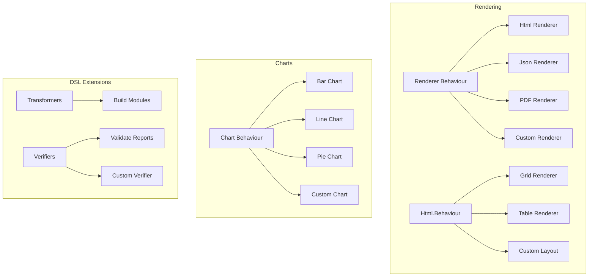

# Extending AshReports

This guide explains how to extend AshReports with custom functionality including custom renderers, chart types, element types, and format specifications.

## Table of Contents

- [Extension Points](#extension-points)
- [Custom Renderers](#custom-renderers)
- [Custom Chart Types](#custom-chart-types)
- [Custom Element Types](#custom-element-types)
- [Custom Format Specifications](#custom-format-specifications)
- [Custom Verifiers](#custom-verifiers)
- [Custom Transformers](#custom-transformers)

## Extension Points

AshReports provides several extension points through behaviours and the Spark DSL system:



### Available Behaviours

| Behaviour | Location | Purpose |
|-----------|----------|---------|
| `AshReports.Renderer` | `lib/ash_reports/renderers/renderer.ex` | Format-specific renderers |
| `AshReports.Charts.Types.Behavior` | `lib/ash_reports/charts/types/behavior.ex` | Chart type implementations |
| `AshReports.Renderer.Html.Behaviour` | `lib/ash_reports/renderer/html/behaviour.ex` | HTML layout renderers |

## Custom Renderers

Create custom renderers to output reports in new formats (e.g., Excel, XML, Markdown).

### Renderer Behaviour

```elixir
defmodule AshReports.Renderer do
  @callback render_with_context(RenderContext.t(), opts :: keyword()) ::
              {:ok, render_result()} | {:error, term()}

  @callback supports_streaming?() :: boolean()

  @callback file_extension() :: String.t()

  @callback content_type() :: String.t()

  # Optional callbacks
  @callback validate_context(RenderContext.t()) :: :ok | {:error, term()}
  @callback prepare(RenderContext.t(), opts :: keyword()) :: {:ok, RenderContext.t()} | {:error, term()}
  @callback cleanup(RenderContext.t(), render_result()) :: :ok
end
```

### Example: Markdown Renderer

```elixir
defmodule MyApp.Renderers.MarkdownRenderer do
  @behaviour AshReports.Renderer

  alias AshReports.RenderContext

  @impl true
  def render_with_context(%RenderContext{} = context, opts \\ []) do
    markdown = build_markdown(context, opts)

    {:ok, %{
      content: markdown,
      metadata: %{format: :markdown, generated_at: DateTime.utc_now()},
      context: context
    }}
  end

  @impl true
  def supports_streaming?, do: false

  @impl true
  def file_extension, do: ".md"

  @impl true
  def content_type, do: "text/markdown"

  # Optional: validate context
  @impl true
  def validate_context(%RenderContext{records: records}) when is_list(records), do: :ok
  def validate_context(_), do: {:error, :invalid_records}

  # Private implementation

  defp build_markdown(context, _opts) do
    """
    # #{context.report.title || context.report.name}

    Generated: #{DateTime.utc_now() |> DateTime.to_iso8601()}

    ## Data

    #{render_records_table(context.records)}

    ## Summary

    #{render_variables(context.variables)}
    """
  end

  defp render_records_table([]), do: "_No data_"

  defp render_records_table([first | _] = records) do
    headers = Map.keys(first) |> Enum.reject(&internal_key?/1)

    header_row = "| " <> Enum.join(headers, " | ") <> " |"
    separator = "| " <> Enum.map(headers, fn _ -> "---" end) |> Enum.join(" | ") <> " |"

    data_rows = Enum.map(records, fn record ->
      values = Enum.map(headers, &format_value(Map.get(record, &1)))
      "| " <> Enum.join(values, " | ") <> " |"
    end)

    Enum.join([header_row, separator | data_rows], "\n")
  end

  defp render_variables(nil), do: "_No variables_"
  defp render_variables(variables) when map_size(variables) == 0, do: "_No variables_"

  defp render_variables(variables) do
    Enum.map(variables, fn {key, value} ->
      "- **#{key}**: #{format_value(value)}"
    end)
    |> Enum.join("\n")
  end

  defp internal_key?(key) when is_atom(key), do: key in [:__meta__, :__struct__]
  defp internal_key?(_), do: false

  defp format_value(nil), do: "-"
  defp format_value(%Decimal{} = d), do: Decimal.to_string(d)
  defp format_value(value), do: to_string(value)
end
```

### Registering Custom Renderers

Use with `RendererIntegration`:

```elixir
defmodule MyApp.Reports do
  def render_as_markdown(domain, report_name, params) do
    with {:ok, data_result} <- AshReports.DataLoader.load_report(domain, report_name, params),
         {:ok, report} <- AshReports.Info.report(domain, report_name) do
      config = %{format: :markdown}
      context = AshReports.RenderContext.new(report, data_result, config)
      MyApp.Renderers.MarkdownRenderer.render_with_context(context)
    end
  end
end
```

## Custom Chart Types

Create custom chart types for specialized visualizations.

### Chart Type Behaviour

```elixir
defmodule AshReports.Charts.Types.Behavior do
  @callback build(data :: list(map()), config :: map()) :: term()
  @callback validate(data :: term()) :: :ok | {:error, String.t()}
end
```

### Example: Radar Chart

```elixir
defmodule MyApp.Charts.RadarChart do
  @moduledoc """
  Radar/Spider chart for multi-dimensional data comparison.

  ## Data Format

      [
        %{category: "Speed", value: 80},
        %{category: "Power", value: 65},
        %{category: "Accuracy", value: 90},
        %{category: "Defense", value: 70},
        %{category: "Agility", value: 85}
      ]
  """

  @behaviour AshReports.Charts.Types.Behavior

  defmodule Config do
    defstruct [
      :title,
      :width,
      :height,
      :colours,
      :max_value,
      :show_legend,
      :fill_opacity
    ]
  end

  @impl true
  def build(data, %Config{} = config) do
    # Build SVG radar chart
    # This example generates raw SVG; in production you might use a library
    svg = generate_radar_svg(data, config)
    {:ok, svg}
  end

  def build(data, config) when is_map(config) do
    config_struct = struct(Config, config)
    build(data, config_struct)
  end

  @impl true
  def validate(data) when is_list(data) and length(data) >= 3 do
    if Enum.all?(data, &valid_point?/1) do
      :ok
    else
      {:error, "All data points must have :category and :value keys"}
    end
  end

  def validate([]), do: {:error, "Data cannot be empty"}
  def validate(data) when is_list(data), do: {:error, "Radar charts need at least 3 data points"}
  def validate(_), do: {:error, "Data must be a list"}

  # Private implementation

  defp valid_point?(%{category: _, value: v}) when is_number(v), do: true
  defp valid_point?(_), do: false

  defp generate_radar_svg(data, config) do
    width = config.width || 400
    height = config.height || 400
    cx = width / 2
    cy = height / 2
    radius = min(cx, cy) * 0.8
    max_val = config.max_value || Enum.max_by(data, & &1.value).value

    n = length(data)
    angle_step = 2 * :math.pi() / n

    # Generate polygon points
    points = data
    |> Enum.with_index()
    |> Enum.map(fn {%{value: value}, i} ->
      angle = i * angle_step - :math.pi() / 2
      r = (value / max_val) * radius
      x = cx + r * :math.cos(angle)
      y = cy + r * :math.sin(angle)
      "#{x},#{y}"
    end)
    |> Enum.join(" ")

    # Generate axis lines and labels
    axes = data
    |> Enum.with_index()
    |> Enum.map(fn {%{category: cat}, i} ->
      angle = i * angle_step - :math.pi() / 2
      x2 = cx + radius * :math.cos(angle)
      y2 = cy + radius * :math.sin(angle)
      lx = cx + (radius + 20) * :math.cos(angle)
      ly = cy + (radius + 20) * :math.sin(angle)

      """
      <line x1="#{cx}" y1="#{cy}" x2="#{x2}" y2="#{y2}" stroke="#ccc" stroke-width="1"/>
      <text x="#{lx}" y="#{ly}" text-anchor="middle" font-size="12">#{cat}</text>
      """
    end)
    |> Enum.join("\n")

    fill_color = List.first(config.colours || ["#4A90D9"])
    opacity = config.fill_opacity || 0.3

    """
    <svg xmlns="http://www.w3.org/2000/svg" width="#{width}" height="#{height}" viewBox="0 0 #{width} #{height}">
      #{axes}
      <polygon points="#{points}" fill="#{fill_color}" fill-opacity="#{opacity}" stroke="#{fill_color}" stroke-width="2"/>
    </svg>
    """
  end
end
```

### Registering Custom Chart Types

To use custom charts, reference them from band elements:

```elixir
# In your report module
defmodule MyApp.Reporting do
  use Ash.Domain, extensions: [AshReports.Domain]

  reports do
    report :performance_report do
      driving_resource MyApp.Performance

      band :charts do
        type :summary

        elements do
          # Custom chart element would need DSL extension
          # For now, use the chart system with custom processing
        end
      end
    end
  end
end
```

## Custom Element Types

Extend the element system with new element types.

### Adding Element to DSL

This requires extending the Spark DSL. Create a new element entity:

```elixir
defmodule MyApp.Elements.QRCodeElement do
  @moduledoc """
  QR Code element for embedding QR codes in reports.
  """

  defstruct [
    :name,
    :data,
    :size,
    :error_correction,
    :position,
    :style
  ]

  @type t :: %__MODULE__{
    name: atom(),
    data: String.t() | {:field, atom()},
    size: pos_integer(),
    error_correction: :low | :medium | :quartile | :high,
    position: keyword(),
    style: keyword()
  }
end
```

### Element Transformer

Add transformation logic in a custom transformer:

```elixir
defmodule MyApp.Transformers.TransformQRElements do
  use Spark.Dsl.Transformer

  def transform(dsl_state) do
    # Transform QR code elements in bands
    # This would integrate with the existing band/element transformation
    {:ok, dsl_state}
  end
end
```

### Element Renderer

Implement rendering for the new element:

```elixir
defmodule MyApp.Renderers.QRCodeRenderer do
  def render(%MyApp.Elements.QRCodeElement{} = element, context) do
    data = resolve_data(element.data, context)
    size = element.size || 100

    # Generate QR code (using a library like eqrcode)
    {:ok, qr} = EQRCode.encode(data)
    svg = EQRCode.svg(qr, width: size)

    {:ok, svg}
  end

  defp resolve_data({:field, field_name}, %{current_record: record}) do
    Map.get(record, field_name, "")
  end

  defp resolve_data(static_data, _context) when is_binary(static_data) do
    static_data
  end
end
```

## Custom Format Specifications

Create custom format specifications for specialized value formatting.

### Format Specification Structure

```elixir
defmodule MyApp.Formats.PhoneNumberFormat do
  @moduledoc """
  Formats phone numbers in various international formats.
  """

  defstruct [
    :country_code,
    :format_style  # :national, :international, :e164
  ]

  def format(value, %__MODULE__{} = spec) do
    case spec.format_style do
      :national -> format_national(value, spec.country_code)
      :international -> format_international(value)
      :e164 -> format_e164(value)
    end
  end

  defp format_national(value, "US") do
    # Format as (XXX) XXX-XXXX
    digits = String.replace(value, ~r/\D/, "")

    case String.length(digits) do
      10 ->
        "(#{String.slice(digits, 0, 3)}) #{String.slice(digits, 3, 3)}-#{String.slice(digits, 6, 4)}"

      11 when String.starts_with?(digits, "1") ->
        digits = String.slice(digits, 1, 10)
        "(#{String.slice(digits, 0, 3)}) #{String.slice(digits, 3, 3)}-#{String.slice(digits, 6, 4)}"

      _ ->
        value
    end
  end

  defp format_international(value) do
    digits = String.replace(value, ~r/\D/, "")
    "+#{digits}"
  end

  defp format_e164(value) do
    digits = String.replace(value, ~r/\D/, "")
    "+#{digits}"
  end
end
```

### Integrating with Value Formatting

Hook into the existing formatting pipeline:

```elixir
defmodule MyApp.Formatters.CustomFormatter do
  def format_value(value, %MyApp.Formats.PhoneNumberFormat{} = spec) do
    MyApp.Formats.PhoneNumberFormat.format(value, spec)
  end

  def format_value(value, spec) do
    # Fall back to default formatting
    AshReports.Formatter.format_value(value, spec)
  end
end
```

## Custom Verifiers

Add compile-time validation for your extensions.

### Verifier Behaviour

Verifiers use `Spark.Dsl.Verifier`:

```elixir
defmodule MyApp.Verifiers.ValidateCustomElements do
  @moduledoc """
  Validates custom elements in report definitions.
  """

  use Spark.Dsl.Verifier

  alias Spark.Dsl.Verifier
  alias Spark.Error.DslError

  @impl true
  def verify(dsl_state) do
    module = Verifier.get_persisted(dsl_state, :module)

    with :ok <- validate_qr_elements(dsl_state, module),
         :ok <- validate_custom_charts(dsl_state, module) do
      :ok
    end
  end

  defp validate_qr_elements(dsl_state, module) do
    reports = AshReports.Info.reports(dsl_state)

    Enum.reduce_while(reports, :ok, fn report, :ok ->
      qr_elements = find_qr_elements(report)

      case validate_qr_data_sources(qr_elements) do
        :ok -> {:cont, :ok}
        {:error, reason} ->
          {:halt, {:error, DslError.exception(
            message: reason,
            path: [:reports, report.name],
            module: module
          )}}
      end
    end)
  end

  defp validate_qr_data_sources(elements) do
    invalid = Enum.filter(elements, fn elem ->
      case elem.data do
        {:field, _} -> false
        data when is_binary(data) -> false
        _ -> true
      end
    end)

    if Enum.empty?(invalid) do
      :ok
    else
      names = Enum.map(invalid, & &1.name)
      {:error, "QR elements #{inspect(names)} have invalid data sources"}
    end
  end

  defp find_qr_elements(report) do
    report.bands
    |> Enum.flat_map(& &1.elements)
    |> Enum.filter(&match?(%MyApp.Elements.QRCodeElement{}, &1))
  end

  defp validate_custom_charts(_dsl_state, _module), do: :ok
end
```

### Registering Verifiers

Add to your domain extension:

```elixir
defmodule MyApp.ReportsExtension do
  use Spark.Dsl.Extension,
    verifiers: [
      MyApp.Verifiers.ValidateCustomElements
    ]
end
```

## Custom Transformers

Add compile-time transformations for custom functionality.

### Transformer Pattern

```elixir
defmodule MyApp.Transformers.EnrichReportMetadata do
  @moduledoc """
  Adds metadata to reports at compile time.
  """

  use Spark.Dsl.Transformer

  alias Spark.Dsl.Transformer

  @impl true
  def transform(dsl_state) do
    reports = AshReports.Info.reports(dsl_state)

    enriched_reports = Enum.map(reports, fn report ->
      metadata = %{
        compiled_at: DateTime.utc_now() |> DateTime.to_iso8601(),
        band_count: length(report.bands),
        element_count: count_elements(report),
        has_groups: length(report.groups) > 0,
        has_charts: has_chart_elements?(report)
      }

      %{report | metadata: Map.merge(report.metadata || %{}, metadata)}
    end)

    {:ok, Transformer.persist(dsl_state, :reports, enriched_reports)}
  end

  @impl true
  def after?(AshReports.Transformers.BuildReportModules), do: false
  def after?(_), do: true

  defp count_elements(report) do
    report.bands
    |> Enum.map(fn band -> length(band.elements || []) end)
    |> Enum.sum()
  end

  defp has_chart_elements?(report) do
    chart_types = [
      AshReports.Element.BarChartElement,
      AshReports.Element.LineChartElement,
      AshReports.Element.PieChartElement
    ]

    report.bands
    |> Enum.flat_map(& &1.elements || [])
    |> Enum.any?(fn elem -> elem.__struct__ in chart_types end)
  end
end
```

### Transformer Ordering

Control when your transformer runs:

```elixir
# Run after specific transformers
def after?(AshReports.Transformers.BuildReportModules), do: true
def after?(_), do: false

# Run before specific transformers
def before?(SomeOtherTransformer), do: true
def before?(_), do: false
```

## Best Practices

### 1. Follow Existing Patterns

Study the existing implementations before creating extensions:

- Look at `AshReports.Renderers.IrHtmlRenderer` for renderer patterns
- Study `AshReports.Charts.Types.BarChart` for chart patterns
- Review `AshReports.Verifiers.ValidateReports` for verifier patterns

### 2. Use Type Specifications

Always include type specifications:

```elixir
@spec render(IR.t(), keyword()) :: String.t()
@spec build(list(map()), Config.t()) :: {:ok, term()} | {:error, term()}
```

### 3. Handle Errors Gracefully

Return tagged tuples for error handling:

```elixir
def render(data, opts) do
  case validate(data) do
    :ok -> {:ok, do_render(data, opts)}
    {:error, reason} -> {:error, {:render_failed, reason}}
  end
end
```

### 4. Emit Telemetry Events

Add telemetry for observability:

```elixir
:telemetry.execute(
  [:my_app, :custom_renderer, :render, :start],
  %{system_time: System.system_time()},
  %{format: :custom}
)
```

### 5. Document Your Extensions

Provide comprehensive documentation:

```elixir
@moduledoc """
Custom renderer for XYZ format.

## Usage

    {:ok, result} = MyApp.CustomRenderer.render_with_context(context)

## Configuration

- `:option1` - Description (default: value)
- `:option2` - Description (default: value)

## Examples

    # Example usage
"""
```

## Next Steps

- [Architecture Overview](architecture-overview.md) - System architecture
- [DSL System](dsl-system.md) - DSL internals
- [Rendering System](rendering-system.md) - Rendering pipeline
