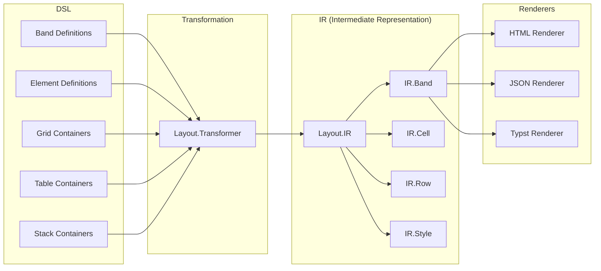

# Layout System

This guide explains how AshReports computes layouts and uses an Intermediate Representation (IR) for format-agnostic rendering.

## Table of Contents

- [Overview](#overview)
- [Layout IR](#layout-ir)
- [Layout Types](#layout-types)
- [IR Structures](#ir-structures)
- [Layout Transformer](#layout-transformer)
- [Layout Engine](#layout-engine)
- [RTL Support](#rtl-support)

## Overview

The layout system provides a normalized intermediate representation between DSL definitions and rendered output:



### Benefits of IR

- **Single source of truth** for layout calculations
- **Format-agnostic** positioning and sizing
- **Consistent output** across all renderers
- **Testable** layout logic independent of rendering

## Layout IR

Location: `lib/ash_reports/layout/ir.ex`

The IR is a normalized representation of the report layout:

```elixir
defmodule AshReports.Layout.IR do
  defstruct [
    :report_name,
    :title,
    :page_dimensions,
    :margins,
    :bands,
    :metadata
  ]

  @type t :: %__MODULE__{
    report_name: atom(),
    title: String.t(),
    page_dimensions: %{width: number(), height: number()},
    margins: %{top: number(), right: number(), bottom: number(), left: number()},
    bands: [IR.Band.t()],
    metadata: map()
  }
end
```

### Creating IR

```elixir
def from_context(context) do
  %__MODULE__{
    report_name: context.report.name,
    title: context.report.title,
    page_dimensions: context.page_dimensions,
    margins: context.config.margins,
    bands: transform_bands(context.report.bands, context),
    metadata: %{
      locale: context.locale,
      text_direction: context.text_direction
    }
  }
end
```

## Layout Types

### Grid Layout

Location: `lib/ash_reports/layout/grid.ex`

CSS Grid-based layout for flexible positioning:

```elixir
defmodule AshReports.Layout.Grid do
  defstruct [
    :name,
    :columns,           # Number of columns or template
    :rows,              # Number of rows or template
    :gap,               # Gap between cells
    :cells,             # List of GridCell
    :style
  ]

  @type t :: %__MODULE__{
    name: atom(),
    columns: pos_integer() | String.t(),
    rows: pos_integer() | String.t(),
    gap: number(),
    cells: [GridCell.t()],
    style: map()
  }
end
```

DSL usage:

```elixir
band :header do
  type :page_header

  grids do
    grid :header_grid do
      columns 3
      gap 10

      cells do
        cell :logo do
          column 1
          content do
            image :company_logo do
              source "logo.png"
            end
          end
        end

        cell :title do
          column 2
          content do
            label :report_title do
              text "Sales Report"
            end
          end
        end

        cell :date do
          column 3
          content do
            field :report_date do
              source :generated_at
              format :date
            end
          end
        end
      end
    end
  end
end
```

### Table Layout

Location: `lib/ash_reports/layout/table.ex`

Tabular layout for data presentation:

```elixir
defmodule AshReports.Layout.Table do
  defstruct [
    :name,
    :columns,           # Column definitions
    :header,            # Header row
    :rows,              # Data rows
    :footer,            # Footer row
    :style
  ]

  @type t :: %__MODULE__{
    name: atom(),
    columns: [Column.t()],
    header: Header.t() | nil,
    rows: [Row.t()],
    footer: Footer.t() | nil,
    style: map()
  }
end
```

DSL usage:

```elixir
band :detail do
  type :detail

  tables do
    table :sales_table do
      columns do
        column :product do
          width 200
          header "Product Name"
        end

        column :quantity do
          width 80
          header "Qty"
          align :right
        end

        column :amount do
          width 100
          header "Amount"
          align :right
        end
      end

      rows do
        row :data_row do
          cells do
            cell :product_name do
              source :product_name
            end

            cell :qty do
              source :quantity
            end

            cell :amt do
              source :amount
              format :currency
            end
          end
        end
      end
    end
  end
end
```

### Stack Layout

Location: `lib/ash_reports/layout/stack.ex`

Flexbox-like stacking:

```elixir
defmodule AshReports.Layout.Stack do
  defstruct [
    :name,
    :direction,         # :horizontal | :vertical
    :justify,           # :start | :center | :end | :space_between | :space_around
    :align,             # :start | :center | :end | :stretch
    :gap,
    :children,
    :style
  ]
end
```

DSL usage:

```elixir
band :summary do
  type :summary

  stacks do
    stack :totals_stack do
      direction :horizontal
      justify :space_between
      gap 20

      children do
        label :total_label do
          text "Grand Total:"
        end

        aggregate :grand_total do
          type :sum
          field :amount
          format :currency
        end
      end
    end
  end
end
```

## IR Structures

### IR.Band

```elixir
defmodule AshReports.Layout.IR.Band do
  defstruct [
    :name,
    :type,
    :position,          # %{x: number, y: number}
    :dimensions,        # %{width: number, height: number}
    :content,           # List of IR.Content
    :style,
    :visible
  ]
end
```

### IR.Cell

```elixir
defmodule AshReports.Layout.IR.Cell do
  defstruct [
    :name,
    :position,          # Grid/table position
    :span,              # Column/row span
    :content,           # Cell content
    :style,
    :alignment
  ]
end
```

### IR.Row

```elixir
defmodule AshReports.Layout.IR.Row do
  defstruct [
    :index,
    :cells,
    :height,
    :style
  ]
end
```

### IR.Content

```elixir
defmodule AshReports.Layout.IR.Content do
  defstruct [
    :type,              # :text | :field | :image | :chart | :line | :box
    :value,             # Resolved value
    :raw_value,         # Original value
    :format,            # Applied format
    :style,
    :position
  ]
end
```

### IR.Line

```elixir
defmodule AshReports.Layout.IR.Line do
  defstruct [
    :direction,         # :horizontal | :vertical
    :start,             # %{x: number, y: number}
    :end,               # %{x: number, y: number}
    :thickness,
    :color,
    :style              # :solid | :dashed | :dotted
  ]
end
```

### IR.Style

```elixir
defmodule AshReports.Layout.IR.Style do
  defstruct [
    # Typography
    :font_family,
    :font_size,
    :font_weight,
    :font_style,
    :text_align,
    :line_height,

    # Colors
    :color,
    :background_color,

    # Spacing
    :padding,
    :margin,

    # Borders
    :border,
    :border_radius,

    # Dimensions
    :width,
    :height,
    :min_width,
    :max_width
  ]
end
```

## Layout Transformer

Location: `lib/ash_reports/layout/transformer.ex`

Transforms DSL structures to IR:

```elixir
defmodule AshReports.Layout.Transformer do
  def to_ir(context) do
    %IR{
      report_name: context.report.name,
      title: context.report.title,
      page_dimensions: context.page_dimensions,
      margins: context.config.margins,
      bands: transform_bands(context),
      metadata: build_metadata(context)
    }
  end

  defp transform_bands(context) do
    context.report.bands
    |> Enum.map(&transform_band(&1, context))
    |> calculate_positions(context)
  end

  defp transform_band(band, context) do
    %IR.Band{
      name: band.name,
      type: band.type,
      content: transform_content(band, context),
      style: transform_style(band.style),
      visible: band.visible
    }
  end

  defp transform_content(band, context) do
    cond do
      band.grids != [] -> transform_grids(band.grids, context)
      band.tables != [] -> transform_tables(band.tables, context)
      band.stacks != [] -> transform_stacks(band.stacks, context)
      true -> transform_elements(band.elements, context)
    end
  end
end
```

### Grid Transformation

```elixir
defp transform_grids(grids, context) do
  Enum.flat_map(grids, fn grid ->
    grid.cells
    |> Enum.map(&transform_grid_cell(&1, grid, context))
    |> position_grid_cells(grid)
  end)
end

defp transform_grid_cell(cell, grid, context) do
  %IR.Cell{
    name: cell.name,
    position: %{column: cell.column, row: cell.row},
    span: %{columns: cell.column_span || 1, rows: cell.row_span || 1},
    content: transform_cell_content(cell.content, context),
    style: transform_style(cell.style)
  }
end
```

### Table Transformation

```elixir
defp transform_tables(tables, context) do
  Enum.flat_map(tables, fn table ->
    header = transform_table_header(table)
    rows = transform_table_rows(table, context)
    footer = transform_table_footer(table)

    [header, rows, footer]
    |> List.flatten()
    |> Enum.reject(&is_nil/1)
  end)
end
```

## Layout Engine

Location: `lib/ash_reports/engines/layout_engine.ex`

Calculates positions and dimensions:

```elixir
defmodule AshReports.LayoutEngine do
  def calculate(context) do
    ir = Layout.Transformer.to_ir(context)

    ir
    |> calculate_band_heights()
    |> calculate_band_positions()
    |> calculate_element_positions()
    |> detect_page_breaks()
  end

  defp calculate_band_heights(ir) do
    bands =
      Enum.map(ir.bands, fn band ->
        height = calculate_band_height(band)
        %{band | dimensions: %{width: page_width(ir), height: height}}
      end)

    %{ir | bands: bands}
  end

  defp calculate_band_positions(ir) do
    {bands, _} =
      Enum.reduce(ir.bands, {[], ir.margins.top}, fn band, {acc, y} ->
        positioned = %{band | position: %{x: ir.margins.left, y: y}}
        {[positioned | acc], y + band.dimensions.height}
      end)

    %{ir | bands: Enum.reverse(bands)}
  end
end
```

### Position Calculation

```elixir
defp calculate_element_positions(ir) do
  bands =
    Enum.map(ir.bands, fn band ->
      content = position_content(band.content, band.position, band.dimensions)
      %{band | content: content}
    end)

  %{ir | bands: bands}
end

defp position_content(content, band_pos, band_dims) when is_list(content) do
  Enum.map(content, &position_element(&1, band_pos, band_dims))
end

defp position_element(%IR.Cell{} = cell, band_pos, _band_dims) do
  # Grid cell positioning
  x = band_pos.x + calculate_column_offset(cell.position.column)
  y = band_pos.y + calculate_row_offset(cell.position.row)
  %{cell | position: %{x: x, y: y}}
end
```

## RTL Support

Location: `lib/ash_reports/engines/rtl_layout_engine.ex`

Right-to-left layout for Arabic, Hebrew, etc.:

```elixir
defmodule AshReports.RTLLayoutEngine do
  @rtl_locales ["ar", "he", "fa", "ur"]

  def apply_rtl(ir, locale) when locale in @rtl_locales do
    %{ir |
      bands: Enum.map(ir.bands, &mirror_band/1),
      metadata: Map.put(ir.metadata, :text_direction, "rtl")
    }
  end

  def apply_rtl(ir, _locale), do: ir

  defp mirror_band(band) do
    %{band |
      content: mirror_content(band.content, band.dimensions.width),
      style: Map.put(band.style, :direction, "rtl")
    }
  end

  defp mirror_content(content, page_width) when is_list(content) do
    Enum.map(content, &mirror_element(&1, page_width))
  end

  defp mirror_element(%{position: %{x: x}} = element, page_width) do
    mirrored_x = page_width - x - element_width(element)
    put_in(element.position.x, mirrored_x)
  end
end
```

### Text Direction

```elixir
defp transform_style(style, %{text_direction: "rtl"}) do
  style
  |> Map.put(:direction, "rtl")
  |> Map.put(:text_align, mirror_alignment(style[:text_align]))
end

defp mirror_alignment(:left), do: :right
defp mirror_alignment(:right), do: :left
defp mirror_alignment(other), do: other
```

## Complete Example

```elixir
# DSL Definition
band :detail do
  type :detail

  grids do
    grid :data_grid do
      columns 4
      gap 5

      cells do
        cell :name do
          column 1
          column_span 2
          content do
            field :customer_name do
              source :name
            end
          end
        end

        cell :amount do
          column 3
          content do
            field :order_amount do
              source :amount
              format :currency
            end
          end
        end

        cell :date do
          column 4
          content do
            field :order_date do
              source :created_at
              format :date
            end
          end
        end
      end
    end
  end
end

# Transformed to IR
%IR{
  bands: [
    %IR.Band{
      name: :detail,
      type: :detail,
      position: %{x: 20, y: 100},
      dimensions: %{width: 555, height: 30},
      content: [
        %IR.Cell{
          name: :name,
          position: %{x: 20, y: 100},
          span: %{columns: 2, rows: 1},
          content: %IR.Content{
            type: :field,
            value: "John Doe",
            style: %IR.Style{...}
          }
        },
        %IR.Cell{
          name: :amount,
          position: %{x: 298, y: 100},
          content: %IR.Content{
            type: :field,
            value: "$1,234.56",
            format: :currency
          }
        },
        %IR.Cell{
          name: :date,
          position: %{x: 437, y: 100},
          content: %IR.Content{
            type: :field,
            value: "2024-03-15",
            format: :date
          }
        }
      ]
    }
  ]
}
```

## Next Steps

- [Chart System](chart-system.md) - Chart generation
- [PDF Generation](typst-pdf-generation.md) - Typst integration
