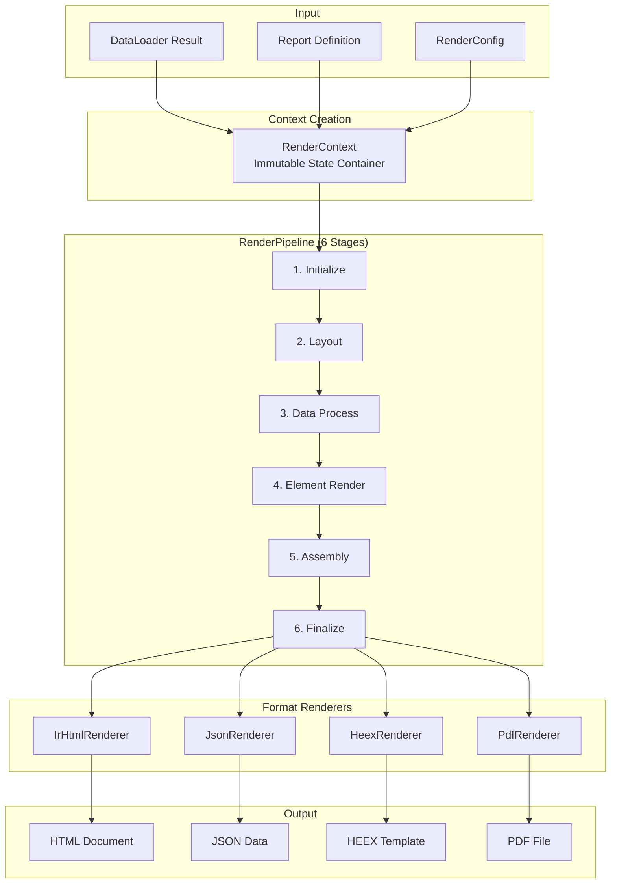
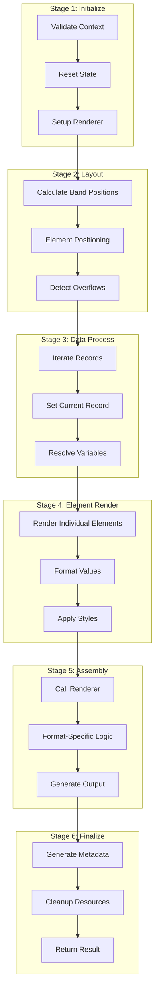

# Rendering Pipeline

This guide explains how AshReports renders processed data to different output formats through the rendering pipeline.

## Table of Contents

- [Pipeline Overview](#pipeline-overview)
- [RenderContext](#rendercontext)
- [RenderConfig](#renderconfig)
- [RenderPipeline](#renderpipeline)
- [Renderer Behaviour](#renderer-behaviour)
- [Format-Specific Renderers](#format-specific-renderers)
- [RendererIntegration](#rendererintegration)

## Pipeline Overview

The rendering system transforms processed data into format-specific output:



## RenderContext

Location: `lib/ash_reports/renderers/render_context.ex`

RenderContext is the central immutable state container that carries all information through the rendering pipeline.

### Structure

```elixir
defmodule AshReports.RenderContext do
  defstruct [
    # Report definition
    :report,

    # Data from DataLoader
    :data_result,
    :records,
    :variables,
    :groups,

    # Configuration
    :config,

    # Current state during rendering
    :current_record,
    :current_record_index,
    :current_band,
    :current_group,
    :current_group_level,

    # Layout state
    :layout_state,
    :current_position,
    :page_dimensions,

    # Rendered content
    :rendered_elements,
    :pending_elements,

    # Localization
    :locale,
    :text_direction,
    :locale_metadata,

    # Error tracking
    :errors,
    :warnings
  ]
end
```

### Creating Context

```elixir
def new(report, data_result, config) do
  %__MODULE__{
    report: report,
    data_result: data_result,
    records: data_result.records,
    variables: data_result.variables,
    groups: data_result.groups,
    config: config,
    current_record: nil,
    current_record_index: 0,
    current_band: nil,
    layout_state: %{},
    current_position: %{x: 0, y: 0},
    page_dimensions: page_dimensions(config),
    rendered_elements: [],
    pending_elements: [],
    locale: config.locale || "en",
    text_direction: text_direction(config.locale),
    errors: [],
    warnings: []
  }
end
```

### Context Updates

Context is immutable - updates return new structs:

```elixir
def set_current_record(context, record, index) do
  %{context | current_record: record, current_record_index: index}
end

def set_current_band(context, band) do
  %{context | current_band: band}
end

def add_rendered_element(context, element) do
  %{context | rendered_elements: [element | context.rendered_elements]}
end

def add_error(context, error) do
  %{context | errors: [error | context.errors]}
end
```

### Accessing Data

```elixir
def get_field_value(context, field_name) do
  case context.current_record do
    nil -> nil
    record -> Map.get(record, field_name)
  end
end

def get_variable_value(context, variable_name) do
  Map.get(context.variables, variable_name)
end

def get_group_value(context, group_name) do
  Map.get(context.groups, group_name)
end
```

## RenderConfig

Location: `lib/ash_reports/renderers/render_config.ex`

RenderConfig holds all configuration for rendering.

### Structure

```elixir
defmodule AshReports.RenderConfig do
  defstruct [
    # Output format
    format: :html,

    # Page layout
    page_size: :a4,
    orientation: :portrait,
    margins: %{top: 20, right: 20, bottom: 20, left: 20},

    # Typography
    font_family: "Arial",
    font_size: 12,
    line_height: 1.5,

    # Colors
    primary_color: "#333333",
    background_color: "#ffffff",

    # Performance
    streaming: false,
    batch_size: 100,
    memory_limit: nil,

    # Localization
    locale: "en",
    timezone: "UTC",

    # Debug
    debug: false,
    include_metadata: false
  ]
end
```

### Preset Configurations

```elixir
def for_large_dataset do
  %__MODULE__{
    streaming: true,
    batch_size: 500,
    memory_limit: 100_000_000  # 100MB
  }
end

def for_debugging do
  %__MODULE__{
    debug: true,
    include_metadata: true
  }
end

def for_production do
  %__MODULE__{
    streaming: true,
    debug: false,
    include_metadata: false
  }
end
```

## RenderPipeline

Location: `lib/ash_reports/renderers/render_pipeline.ex`

RenderPipeline orchestrates the 6-stage rendering process.

### Pipeline Stages



### Implementation

```elixir
defmodule AshReports.RenderPipeline do
  def execute(context, renderer) do
    context
    |> stage_initialize(renderer)
    |> stage_layout()
    |> stage_data_process()
    |> stage_element_render()
    |> stage_assembly(renderer)
    |> stage_finalize()
  end

  defp stage_initialize(context, renderer) do
    with :ok <- validate_context(context),
         :ok <- renderer.validate_context(context),
         {:ok, context} <- renderer.prepare(context) do
      {:ok, context}
    end
  end

  defp stage_layout({:ok, context}) do
    layout_state = AshReports.LayoutEngine.calculate(context)
    {:ok, %{context | layout_state: layout_state}}
  end

  defp stage_data_process({:ok, context}) do
    processed =
      Enum.reduce(context.records, context, fn record, ctx ->
        ctx
        |> set_current_record(record, ctx.current_record_index + 1)
        |> resolve_variables_for_record()
      end)

    {:ok, processed}
  end

  defp stage_element_render({:ok, context}) do
    rendered =
      Enum.reduce(context.report.bands, context, fn band, ctx ->
        render_band(ctx, band)
      end)

    {:ok, rendered}
  end

  defp stage_assembly({:ok, context}, renderer) do
    case renderer.render_with_context(context) do
      {:ok, content} -> {:ok, context, content}
      {:error, error} -> {:error, error}
    end
  end

  defp stage_finalize({:ok, context, content}) do
    {:ok, %{
      content: content,
      metadata: build_metadata(context),
      context: context
    }}
  end
end
```

### Error Handling Strategies

```elixir
defmodule AshReports.RenderPipeline do
  @strategies [:fail_fast, :continue_on_error, :collect_errors]

  def execute(context, renderer, opts \\ []) do
    strategy = Keyword.get(opts, :error_strategy, :fail_fast)

    case strategy do
      :fail_fast -> execute_fail_fast(context, renderer)
      :continue_on_error -> execute_continue(context, renderer)
      :collect_errors -> execute_collect(context, renderer)
    end
  end
end
```

## Renderer Behaviour

Location: `lib/ash_reports/renderers/renderer.ex`

All renderers implement this behaviour:

```elixir
defmodule AshReports.Renderer do
  @callback render_with_context(RenderContext.t()) ::
    {:ok, String.t()} | {:error, term()}

  @callback supports_streaming?() :: boolean()

  @callback file_extension() :: String.t()

  @callback content_type() :: String.t()

  # Optional callbacks
  @optional_callbacks validate_context: 1, prepare: 1, cleanup: 2

  @callback validate_context(RenderContext.t()) :: :ok | {:error, term()}

  @callback prepare(RenderContext.t()) :: {:ok, RenderContext.t()} | {:error, term()}

  @callback cleanup(RenderContext.t(), term()) :: :ok
end
```

### Implementing a Renderer

```elixir
defmodule MyApp.CustomRenderer do
  @behaviour AshReports.Renderer

  @impl true
  def render_with_context(context) do
    content = build_output(context)
    {:ok, content}
  end

  @impl true
  def supports_streaming?, do: false

  @impl true
  def file_extension, do: ".custom"

  @impl true
  def content_type, do: "application/x-custom"

  @impl true
  def validate_context(context) do
    # Custom validation
    :ok
  end
end
```

## Format-Specific Renderers

### IrHtmlRenderer

Location: `lib/ash_reports/renderers/ir_html_renderer.ex`

Renders Layout IR to HTML with CSS Grid:

```elixir
defmodule AshReports.Renderers.IrHtmlRenderer do
  @behaviour AshReports.Renderer

  @impl true
  def render_with_context(context) do
    ir = AshReports.Layout.Transformer.to_ir(context)

    html =
      ir
      |> render_document()
      |> wrap_with_styles(context.config)

    {:ok, html}
  end

  defp render_document(ir) do
    """
    <!DOCTYPE html>
    <html>
    <head>#{render_head(ir)}</head>
    <body>#{render_body(ir)}</body>
    </html>
    """
  end

  defp render_body(ir) do
    ir.bands
    |> Enum.map(&render_band/1)
    |> Enum.join("\n")
  end

  defp render_band(%{type: type, elements: elements}) do
    """
    <div class="band band-#{type}">
      #{render_elements(elements)}
    </div>
    """
  end
end
```

### JsonRenderer

Location: `lib/ash_reports/renderers/json_renderer/json_renderer.ex`

Serializes Layout IR to JSON:

```elixir
defmodule AshReports.Renderers.JsonRenderer do
  @behaviour AshReports.Renderer

  @impl true
  def render_with_context(context) do
    ir = AshReports.Layout.Transformer.to_ir(context)

    json_data = %{
      report: serialize_report(context.report),
      bands: Enum.map(ir.bands, &serialize_band/1),
      records: context.records,
      variables: context.variables,
      groups: serialize_groups(context.groups),
      metadata: build_metadata(context)
    }

    {:ok, Jason.encode!(json_data)}
  end

  defp serialize_band(band) do
    %{
      name: band.name,
      type: band.type,
      elements: Enum.map(band.elements, &serialize_element/1)
    }
  end
end
```

### HeexRenderer

Location: `lib/ash_reports/renderers/heex_renderer/heex_renderer.ex`

Generates Phoenix HEEX templates:

```elixir
defmodule AshReports.Renderers.HeexRenderer do
  @behaviour AshReports.Renderer

  @impl true
  def render_with_context(context) do
    template = generate_heex_template(context)
    {:ok, template}
  end

  defp generate_heex_template(context) do
    """
    <div class="report" id="report-#{context.report.name}">
      <%= for band <- @bands do %>
        <.band band={band} records={@records} />
      <% end %>
    </div>
    """
  end
end
```

### PdfRenderer / Typst

Location: `lib/ash_reports/renderers/pdf_renderer.ex`

Generates PDF via Typst:

```elixir
defmodule AshReports.Renderers.PdfRenderer do
  @behaviour AshReports.Renderer

  @impl true
  def render_with_context(context) do
    typst_content = AshReports.Typst.DSLGenerator.generate(context)
    AshReports.Typst.BinaryWrapper.compile(typst_content)
  end
end
```

## RendererIntegration

Location: `lib/ash_reports/renderers/renderer_integration.ex`

Bridges DataLoader and Rendering:

```elixir
defmodule AshReports.RendererIntegration do
  def render_report(domain, report_name, params, opts \\ []) do
    format = Keyword.get(opts, :format, :html)
    renderer = get_renderer(format)

    with {:ok, data_result} <- DataLoader.load_report(domain, report_name, params, opts),
         {:ok, report} <- get_report(domain, report_name),
         config <- build_config(opts),
         context <- RenderContext.new(report, data_result, config),
         {:ok, result} <- RenderPipeline.execute(context, renderer) do
      {:ok, result}
    end
  end

  defp get_renderer(:html), do: AshReports.Renderers.IrHtmlRenderer
  defp get_renderer(:json), do: AshReports.Renderers.JsonRenderer
  defp get_renderer(:heex), do: AshReports.Renderers.HeexRenderer
  defp get_renderer(:pdf), do: AshReports.Renderers.PdfRenderer
end
```

### Usage

```elixir
# Render to HTML
{:ok, result} = AshReports.RendererIntegration.render_report(
  MyApp.Reporting,
  :sales_report,
  %{year: 2024},
  format: :html
)

# Access output
result.content      # HTML string
result.metadata     # %{render_time: 150, format: :html, ...}
result.context      # Final RenderContext

# Render to PDF
{:ok, pdf_result} = AshReports.RendererIntegration.render_report(
  MyApp.Reporting,
  :sales_report,
  %{year: 2024},
  format: :pdf
)

File.write!("report.pdf", pdf_result.content)
```

## Next Steps

- [Layout System](layout-system.md) - Layout computation and IR
- [Chart System](chart-system.md) - Chart rendering
- [PDF Generation](typst-pdf-generation.md) - Typst integration
