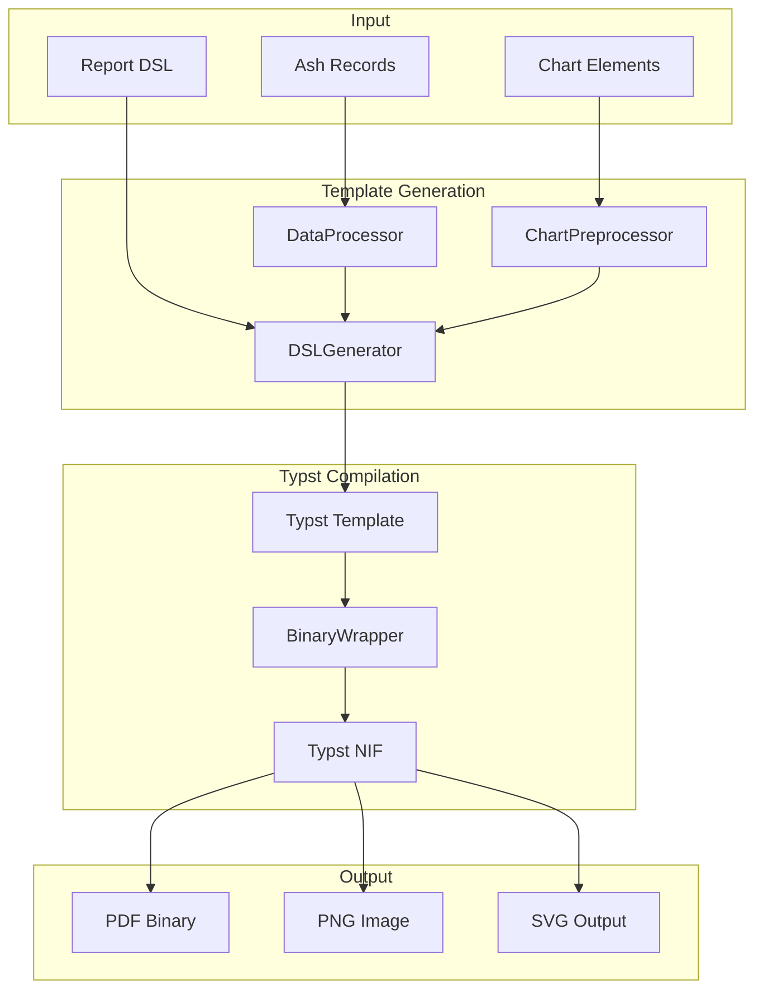
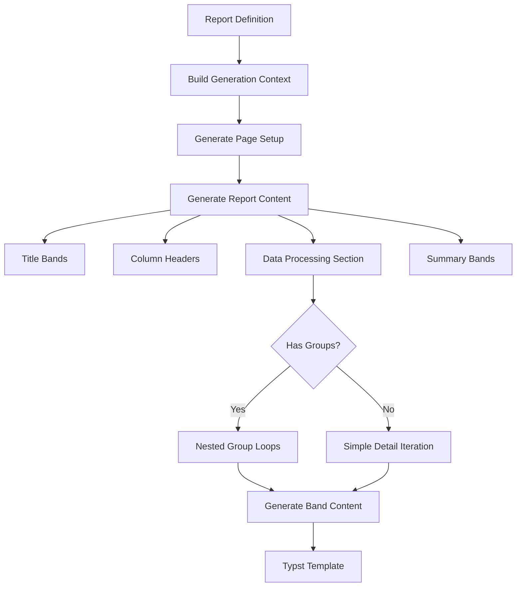
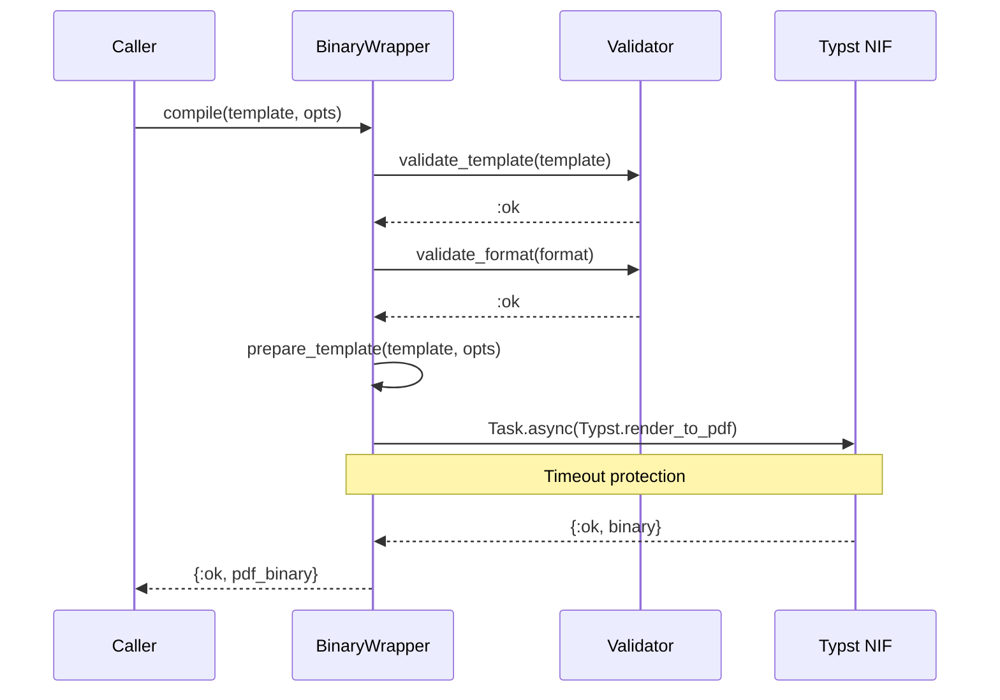
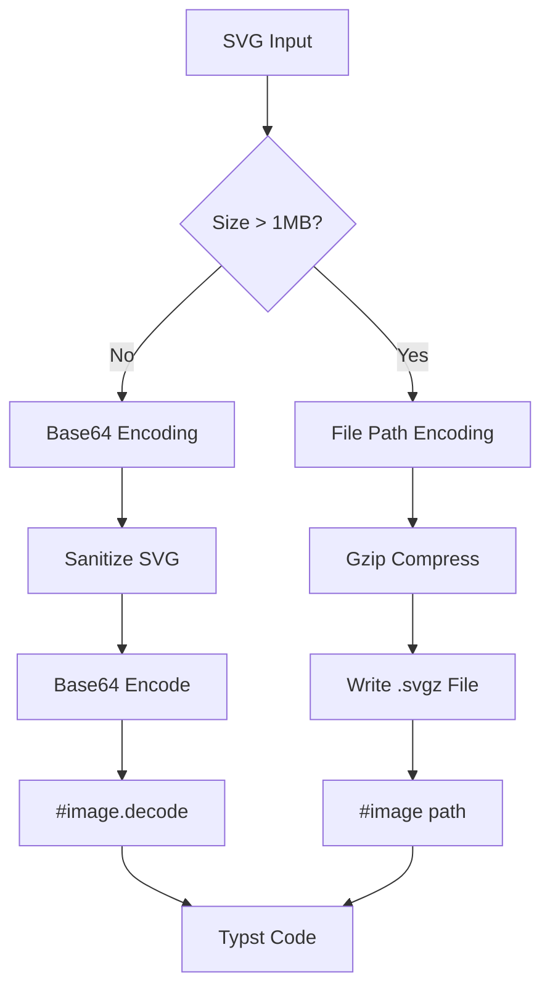
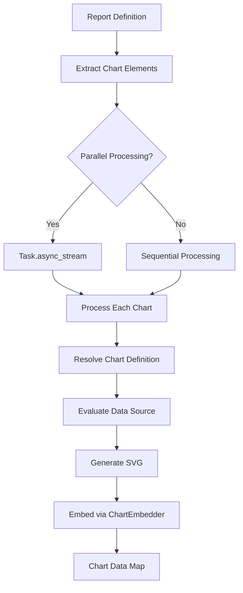
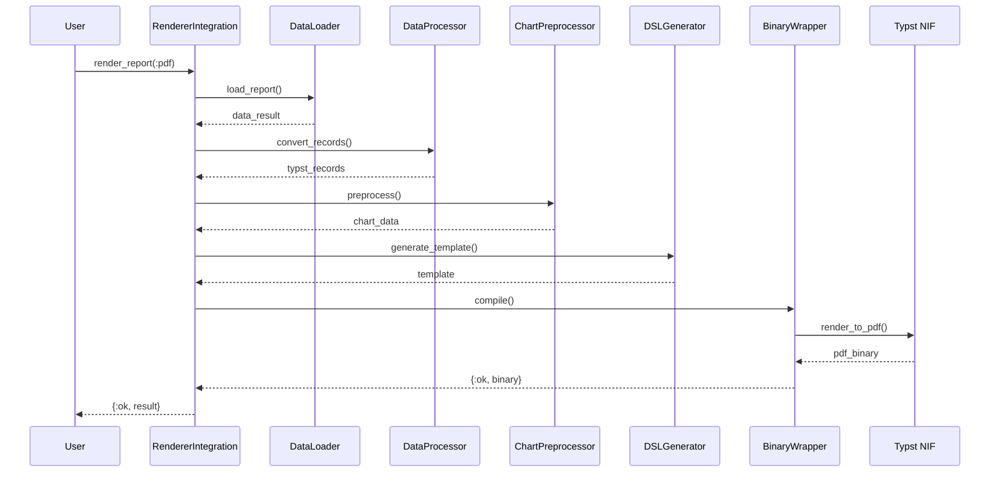

# PDF Generation with Typst

This guide explains how AshReports generates PDF output through the Typst markup language and rendering pipeline.

## Table of Contents

- [Overview](#overview)
- [Typst Markup Language](#typst-markup-language)
- [DSLGenerator](#dslgenerator)
- [BinaryWrapper](#binarywrapper)
- [DataProcessor](#dataprocessor)
- [ChartEmbedder](#chartembedder)
- [ChartPreprocessor](#chartpreprocessor)
- [Typst Renderer](#typst-renderer)
- [Complete Pipeline](#complete-pipeline)

## Overview

AshReports generates PDFs using Typst, a modern typesetting system that compiles markup to PDF. The pipeline transforms report DSL definitions into Typst templates, embeds data, and compiles to binary PDF output.



### Key Components

| Component | Location | Responsibility |
|-----------|----------|----------------|
| DSLGenerator | `lib/ash_reports/typst/dsl_generator.ex` | DSL to Typst template conversion |
| BinaryWrapper | `lib/ash_reports/typst/binary_wrapper.ex` | NIF interface for compilation |
| DataProcessor | `lib/ash_reports/typst/data_processor.ex` | Ash struct to Typst data conversion |
| ChartEmbedder | `lib/ash_reports/typst/chart_embedder.ex` | SVG chart embedding |
| ChartPreprocessor | `lib/ash_reports/typst/chart_preprocessor.ex` | Pre-render charts for templates |
| Typst Renderer | `lib/ash_reports/renderer/typst.ex` | IR to Typst markup |

## Typst Markup Language

Typst is a modern typesetting language designed as an alternative to LaTeX. AshReports leverages its features for report generation:

### Basic Syntax

```typst
// Document configuration
#set page(paper: "a4", margin: (x: 2cm, y: 2cm))
#set text(font: "Liberation Serif", size: 11pt)

// Content blocks
[This is a content block]

// Variables and expressions
#let total = 1500
The total is #total

// Conditionals
#if total > 1000 [
  High value alert!
]

// Loops
#for item in data.records [
  #item.name: #item.value
]
```

### Key Typst Constructs Used

| Construct | Purpose | Example |
|-----------|---------|---------|
| `#set page()` | Page configuration | `#set page(paper: "a4")` |
| `#set text()` | Typography defaults | `#set text(size: 12pt)` |
| `#grid()` | CSS Grid-like layouts | `#grid(columns: (1fr, 2fr))` |
| `#table()` | Tabular data | `#table(columns: 3, ...)` |
| `#image()` | Image embedding | `#image("chart.svg")` |
| `#image.decode()` | Base64 image embedding | `#image.decode("...")` |
| `for` | Iteration over data | `#for r in records [...]` |
| `fold` | Accumulation (grouping) | `data.fold(init, fn)` |

## DSLGenerator

Location: `lib/ash_reports/typst/dsl_generator.ex`

DSLGenerator converts AshReports DSL definitions into Typst templates. It handles the complex transformation of bands, elements, groups, and variables into Typst code.

### Generation Flow



### Main API

```elixir
defmodule AshReports.Typst.DSLGenerator do
  @spec generate_template(Report.t(), Keyword.t()) :: {:ok, String.t()} | {:error, term()}
  def generate_template(report, options \\ [])

  # Options:
  # - :format - Target format (:pdf, :png, :svg), defaults to :pdf
  # - :theme - Theme name for styling, defaults to "default"
  # - :debug - Include debug comments in template, defaults to false
  # - :context - RenderContext with records and variables
end
```

### Generated Template Structure

```typst
// Generated Typst template for report: sales_report
// Generated at: 2024-03-15T10:30:00Z

// Helper function for decimal formatting
#let format-decimal(value, places) = {
  // ... formatting logic
}

#let sales_report(data, config: (:)) = {
  // Page configuration
  set page(
    paper: "a4",
    margin: (x: 2cm, y: 2cm),
    header: [...],
    footer: [Page #counter(page).display() of #counter(page).final().at(0)]
  )

  // Document properties
  set document(title: "Sales Report", author: "AshReports")
  set text(font: "Liberation Serif", size: 11pt)

  // Title Section
  [= Sales Report]

  // Column Header Section
  #table(columns: 3, [Product], [Qty], [Amount])

  // Data Processing Section
  for record in data.records {
    #table(columns: 3, [#record.product], [#record.qty], [#record.amount])
  }

  // Summary Section
  [Total: #data.variables.total]
}

// Data serialization
#let report_data = (records: (...), variables: (:))
#sales_report(report_data, config: ())
```

### Band Processing

The generator processes bands in a specific order:

1. **Title bands** - Once at report start
2. **Page headers/footers** - Set in page configuration
3. **Column headers** - Once before data
4. **Group headers** - At each group break
5. **Detail bands** - For each record
6. **Group footers** - At end of each group
7. **Summary bands** - Once at report end

### Grouping Logic

For grouped reports, DSLGenerator uses Typst's `fold` function to handle immutable variables:

```typst
// Grouping by region
{
  let get_group_value(record) = {
    record.at("region", default: none)
  }

  let result = data.records.fold(
    (prev: none, groups: (), current_records: ()),
    (acc, record) => {
      let current_val = get_group_value(record)
      if acc.prev != none and acc.prev != current_val {
        // Group break - save previous group and start new one
        let new_groups = acc.groups + ((key: acc.prev, records: acc.current_records),)
        (prev: current_val, groups: new_groups, current_records: (record,))
      } else {
        // Same group - accumulate
        (prev: current_val, groups: acc.groups, current_records: acc.current_records + (record,))
      }
    }
  )

  // Add the final group
  let all_groups = if result.current_records.len() > 0 {
    result.groups + ((key: result.prev, records: result.current_records),)
  } else {
    result.groups
  }

  // Render all groups
  for group in all_groups {
    [Group: #group.key]
    for record in group.records {
      [#record.name: #record.value]
    }
  }
}
```

### Element Conversion

Each element type is converted to appropriate Typst code:

```elixir
# Field element
generate_field_element(%{source: :amount, format: :currency, decimal_places: 2})
# => [\$#{ let v = record.amount; if v == none { "-" } else { format-decimal(v, 2) } }]

# Label element
generate_label_element(%{text: "Total: [total_amount]"})
# => [Total: #data.variables.total_amount]

# Aggregate element
generate_aggregate_element(%{function: :sum, source: :amount})
# => [Sum: #data.records.map(r => r.amount).sum()]

# Line element
generate_line_element(%{orientation: :horizontal, thickness: 1})
# => [#line(length: 100%, stroke: 1pt)]

# Image element
generate_image_element(%{source: "logo.png", scale_mode: :fit})
# => [#image("logo.png", width: 5cm, fit: "contain")]
```

### Layout Transformation

Grid, Table, and Stack DSL entities are transformed via their IR representations:

```elixir
defp generate_grid_content(grid, context) do
  alias AshReports.Layout.Transformer.Grid, as: GridTransformer
  alias AshReports.Renderer.Typst.Grid, as: GridRenderer

  case GridTransformer.transform(grid) do
    {:ok, ir} ->
      rendered = GridRenderer.render(ir, generate_refs: true)
      # Wrap in block with full width
      "block(width: 100%, above: 0pt, below: 0pt)[#{rendered}]"

    {:error, reason} ->
      "// Grid transformation failed: #{grid.name}"
  end
end
```

## BinaryWrapper

Location: `lib/ash_reports/typst/binary_wrapper.ex`

BinaryWrapper provides a safe interface to the Typst Rust NIF for document compilation.

### Compilation API

```elixir
defmodule AshReports.Typst.BinaryWrapper do
  @spec compile(String.t(), Keyword.t()) :: {:ok, binary()} | {:error, term()}
  def compile(template, opts \\ [])

  # Options:
  # - :format - Output format (:pdf, :png, :svg). Defaults to :pdf
  # - :timeout - Compilation timeout in ms. Defaults to 30_000
  # - :working_dir - Working directory for template resolution
  # - :font_paths - Additional font directories

  @spec compile_file(String.t(), Keyword.t()) :: {:ok, binary()} | {:error, term()}
  def compile_file(file_path, opts \\ [])

  @spec validate_nif() :: :ok | {:error, :nif_not_loaded}
  def validate_nif()
end
```

### Compilation Flow



### Error Handling

```elixir
defp parse_typst_error(error) when is_binary(error) do
  cond do
    String.contains?(error, "syntax error") ->
      %{type: :syntax_error, message: error}

    String.contains?(error, "not found") ->
      %{type: :file_not_found, message: error}

    String.contains?(error, "font") ->
      %{type: :font_error, message: error}

    true ->
      %{type: :compilation_error, message: error}
  end
end
```

## DataProcessor

Location: `lib/ash_reports/typst/data_processor.ex`

DataProcessor converts Ash resource structs into Typst-compatible data structures with proper type handling.

### Type Conversion Strategy

| Ash Type | Typst Format | Example |
|----------|--------------|---------|
| DateTime | ISO8601 string | `"2024-01-15T10:30:00Z"` |
| Decimal | Float or string | `1500.0` or `"1500.00"` |
| Money | Formatted string | `"$1,500.00"` |
| UUID | String | `"550e8400-e29b-..."` |
| nil | Empty or default | `""` |
| Structs | Flattened maps | `%{address_city: "NYC"}` |

### Conversion API

```elixir
defmodule AshReports.Typst.DataProcessor do
  @spec convert_records([struct()], conversion_options()) ::
          {:ok, [typst_record()]} | {:error, term()}
  def convert_records(ash_records, options \\ [])

  # Options:
  # - :datetime_format - :iso8601 or :custom
  # - :decimal_precision - Decimal places (default: 2)
  # - :decimal_as_string - Output as string (default: false)
  # - :money_format - :symbol, :code, or :none
  # - :nil_replacement - Value for nils (default: "")
  # - :flatten_relationships - Include relationships (default: true)
  # - :relationship_depth - Max traversal depth (default: 3)
end
```

### Relationship Flattening

```elixir
# Input
%Customer{
  name: "Acme Corp",
  address: %Address{city: "New York", country: "US"}
}

# Output (flattened)
%{
  name: "Acme Corp",
  address_city: "New York",
  address_country: "US"
}
```

### Data Serialization for Typst

DSLGenerator serializes converted records into Typst data literals:

```elixir
defp serialize_records(records) when is_list(records) do
  serialized =
    records
    |> Enum.map(&serialize_record/1)
    |> Enum.join(",\n    ")

  "(#{serialized})"
end

defp serialize_value(%Decimal{} = decimal), do: Decimal.to_string(decimal)
defp serialize_value(%DateTime{} = dt), do: "\"#{DateTime.to_iso8601(dt)}\""
defp serialize_value(nil), do: "none"
defp serialize_value(value) when is_binary(value) do
  escaped = String.replace(value, "\"", "\\\"")
  "\"#{escaped}\""
end
```

## ChartEmbedder

Location: `lib/ash_reports/typst/chart_embedder.ex`

ChartEmbedder converts SVG charts into Typst code for embedding in PDF documents.

### Encoding Strategies



### Embedding API

```elixir
defmodule AshReports.Typst.ChartEmbedder do
  @spec embed(String.t(), keyword()) :: {:ok, String.t()} | {:error, term()}
  def embed(svg, opts \\ [])

  # Options:
  # - :width - Chart width (e.g., "100%", "300pt")
  # - :height - Chart height
  # - :caption - Caption text below chart
  # - :title - Title text above chart
  # - :encoding - :base64 (default) or :file

  @spec embed_grid(list({String.t(), keyword()}), keyword()) ::
          {:ok, String.t()} | {:error, term()}
  def embed_grid(charts, layout_opts \\ [])
  # For grid layouts of multiple charts

  @spec embed_flow(list({String.t(), keyword()}), keyword()) ::
          {:ok, String.t()} | {:error, term()}
  def embed_flow(charts, opts \\ [])
  # For vertical stacking of charts

  @spec generate_and_embed(atom(), list(map()), Config.t(), keyword()) ::
          {:ok, String.t()} | {:error, term()}
  def generate_and_embed(chart_type, data, config, embed_opts \\ [])
  # Generate and embed in one operation
end
```

### SVG Sanitization

ChartEmbedder sanitizes SVG to prevent XSS attacks:

```elixir
defp sanitize_svg(svg) when is_binary(svg) do
  svg
  # Remove script tags
  |> String.replace(~r/<script\b[^<]*(?:(?!<\/script>)<[^<]*)*<\/script>/i, "")
  # Remove event handler attributes
  |> String.replace(~r/\s+on\w+\s*=\s*["'][^"']*["']/i, "")
  # Remove javascript: protocol
  |> String.replace(~r/href\s*=\s*["']javascript:[^"']*["']/i, "")
  # Remove foreignObject elements
  |> String.replace(~r/<foreignObject\b[^<]*(?:(?!<\/foreignObject>)<[^<]*)*<\/foreignObject>/i, "")
end
```

### Generated Typst Code

```typst
// Base64 embedded chart
#image.decode("PHN2ZyB4bWxucz0iaHR0cDov...", format: "svg", width: 100%)

// With title and caption
#text(size: 14pt, weight: "bold")[Sales by Region]
#image.decode("...", format: "svg", width: 100%)
#text(size: 10pt, style: "italic")[Figure 1: Q3 Sales Distribution]
```

## ChartPreprocessor

Location: `lib/ash_reports/typst/chart_preprocessor.ex`

ChartPreprocessor pre-renders chart elements before template generation for optimal performance.

### Processing Flow



### Preprocessing API

```elixir
defmodule AshReports.Typst.ChartPreprocessor do
  @spec preprocess(Report.t(), data_context(), keyword()) ::
          {:ok, %{atom() => chart_data()}} | {:error, term()}
  def preprocess(report, data_context, opts \\ [])

  # Options:
  # - :parallel - Enable parallel processing (default: true)
  # - :max_concurrency - Max concurrent generations (default: CPU cores × 2)
  # - :timeout - Timeout per chart in ms (default: 10_000)
  # - :on_timeout - :kill_task or :error (default: :kill_task)

  @spec preprocess_lazy(Report.t(), data_context()) ::
          {:ok, %{atom() => (-> chart_data())}}
  def preprocess_lazy(report, data_context)
  # Returns lazy evaluator functions for on-demand generation
end
```

### Data Context Format

```elixir
%{
  records: [%{field: value, ...}, ...],
  config: %{param: value, ...},
  variables: %{var: value, ...},
  domain: MyApp.Reporting  # Required for chart definition lookup
}
```

### Telemetry Events

| Event | Measurements | Metadata |
|-------|--------------|----------|
| `[:ash_reports, :chart_preprocessor, :preprocess, :start]` | system_time | chart_count, parallel |
| `[:ash_reports, :chart_preprocessor, :preprocess, :stop]` | duration | success_count |
| `[:ash_reports, :chart_preprocessor, :process_chart, :start]` | system_time | chart_name, chart_type |
| `[:ash_reports, :chart_preprocessor, :process_chart, :stop]` | duration, svg_size | success |

## Typst Renderer

Location: `lib/ash_reports/renderer/typst.ex`

The Typst Renderer converts Layout IR structures into Typst markup, coordinating with specialized sub-renderers.

### Sub-Renderers

| Renderer | Location | Purpose |
|----------|----------|---------|
| Grid | `lib/ash_reports/renderer/typst/grid.ex` | `#grid()` layouts |
| Table | `lib/ash_reports/renderer/typst/table.ex` | `#table()` layouts |
| Stack | `lib/ash_reports/renderer/typst/stack.ex` | Stack layouts |
| Lines | `lib/ash_reports/renderer/typst/lines.ex` | `#line()` elements |

### Rendering API

```elixir
defmodule AshReports.Renderer.Typst do
  @spec render(IR.t(), keyword()) :: String.t()
  def render(ir, opts \\ [])
  # Renders single layout IR to Typst markup

  @spec render_report([IR.t()], map(), keyword()) :: String.t()
  def render_report(layouts, data \\ %{}, opts \\ [])
  # Renders complete report from multiple IRs

  @spec render_layouts([IR.t()], keyword()) :: String.t()
  def render_layouts(layouts, opts \\ [])
  # Renders multiple layouts in sequence
end
```

### Generated Grid Markup

```typst
#grid(
  columns: (1fr, 2fr),
  gutter: 10pt,
  [Customer Name],
  [#record.name],
  [Order Amount],
  [#record.amount]
)
```

### Generated Table Markup

```typst
#table(
  columns: 3,
  stroke: 0.5pt,
  table.header([Product], [Qty], [Amount]),
  ..for record in data.records {
    ([#record.product], [#record.qty], [#record.amount])
  }
)
```

## Complete Pipeline

### End-to-End PDF Generation

```elixir
# 1. Load report data
{:ok, data_result} = AshReports.DataLoader.load_report(
  MyApp.Reporting,
  :sales_report,
  %{year: 2024}
)

# 2. Get report definition
{:ok, report} = AshReports.Info.report(MyApp.Reporting, :sales_report)

# 3. Convert data for Typst
{:ok, typst_records} = AshReports.Typst.DataProcessor.convert_records(
  data_result.records,
  decimal_precision: 2,
  flatten_relationships: true
)

# 4. Preprocess charts (if any)
data_context = %{
  records: typst_records,
  variables: data_result.variables,
  domain: MyApp.Reporting
}

{:ok, chart_data} = AshReports.Typst.ChartPreprocessor.preprocess(
  report,
  data_context,
  parallel: true
)

# 5. Generate Typst template
context = %{
  records: typst_records,
  variables: data_result.variables
}

{:ok, template} = AshReports.Typst.DSLGenerator.generate_template(
  report,
  context: context,
  debug: false
)

# 6. Compile to PDF
{:ok, pdf_binary} = AshReports.Typst.BinaryWrapper.compile(
  template,
  format: :pdf,
  timeout: 30_000
)

# 7. Write output
File.write!("report.pdf", pdf_binary)
```

### Using RendererIntegration

The simpler approach uses `RendererIntegration`:

```elixir
{:ok, result} = AshReports.RendererIntegration.render_report(
  MyApp.Reporting,
  :sales_report,
  %{year: 2024},
  format: :pdf
)

File.write!("report.pdf", result.content)
```

### Pipeline Diagram



## Next Steps

- [Chart System](chart-system.md) - Chart generation details
- [Layout System](layout-system.md) - Layout IR structures
- [Extending AshReports](extending-ash-reports.md) - Custom renderers
