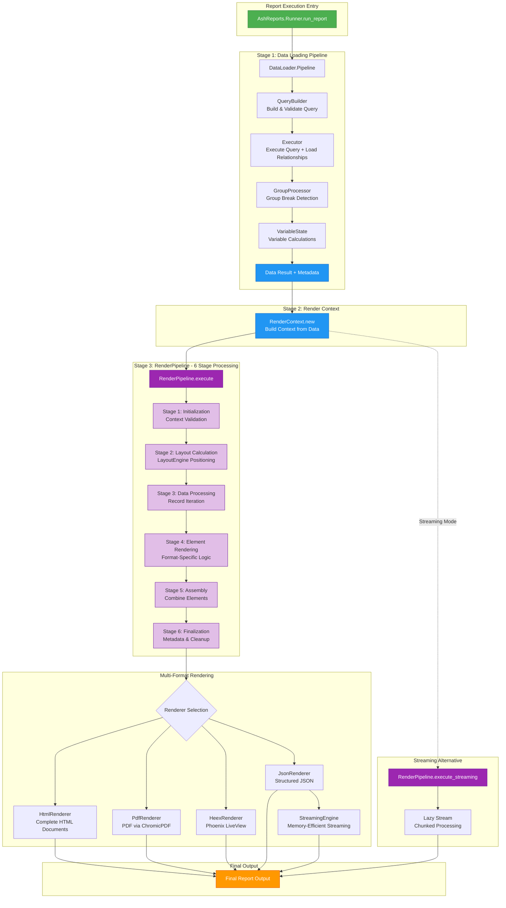
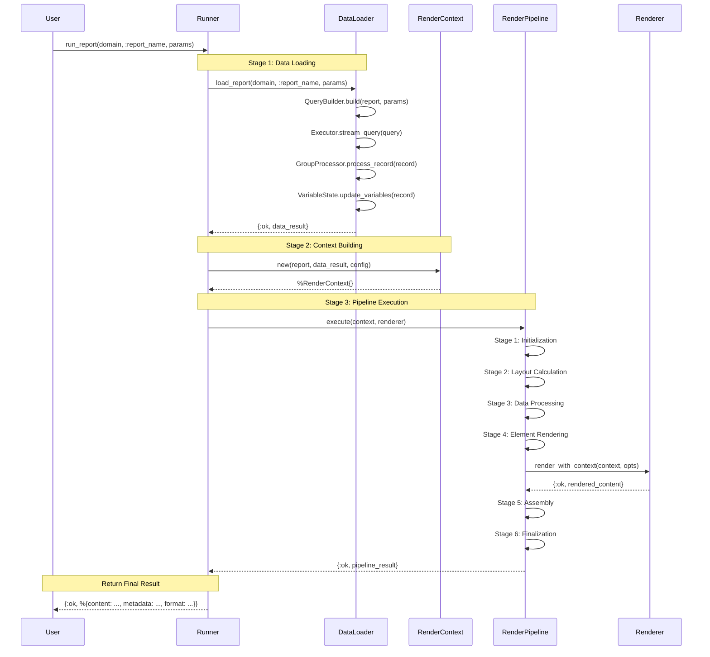
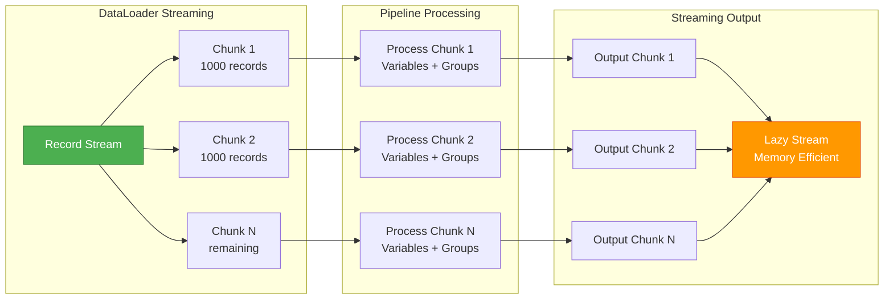

# AshReports Typst Integration Refactor Implementation Plan

## 📋 Overview

This plan implements a complete architectural refactor of AshReports to replace the current rendering system with a modern Typst-based engine. The refactor leverages Typst's **18x faster compilation speed**, native multi-format output support, and seamless integration with Elixir's concurrent processing capabilities.

**Current Status**: AshReports has a complete Spark DSL framework with band-based report definitions, but needs modern Typst integration for performance.

**Target Architecture**: DSL-driven Typst template generation → 18x faster compilation → Modern multi-format output (PDF, PNG, SVG)

**Key Architectural Insight**: Generate Typst templates dynamically from AshReports DSL definitions rather than managing static template files.

---

# Stage 1: Infrastructure Foundation and Typst Integration

**Duration**: 2-3 weeks
**Status**: 🚧 In Progress - **Section 1.1 COMPLETED** ✅
**Goal**: Establish core Typst integration infrastructure and replace basic rendering pipeline

## 1.1 Typst Runtime Integration

### 1.1.1 Elixir Typst Bindings Setup
- [x] Add Typst Elixir bindings dependency (typst 0.1.7) - **COMPLETED**
- [x] Configure Rustler for Typst compilation integration - **COMPLETED**
- [x] Implement basic Typst rendering interface - **COMPLETED**
- [x] Create Typst binary wrapper module - **COMPLETED**
- [x] Add error handling for Typst compilation failures - **COMPLETED**

### 1.1.2 ~~Template Engine Foundation~~ → **ARCHITECTURAL PIVOT**
- [x] ~~Create `AshReports.Typst.TemplateManager` module~~ - **REPLACED with DSL-driven approach**
- [x] ~~Implement file-based template system~~ - **PIVOTED to DSL-to-Typst generation**
- [x] Add template caching with ETS - **REUSED in new architecture**
- [x] Create hot-reloading for development environment - **REUSED for generated templates**
- [x] Implement template validation and compilation checking - **REUSED with BinaryWrapper**

**🔄 ARCHITECTURAL DECISION**: Pivot from manual template files to DSL-driven template generation.
AshReports should generate Typst templates dynamically from Spark DSL report definitions, not load static `.typ` files.

## 1.2 DSL-to-Typst Template Generation **← NEW PRIORITY**

### 1.2.1 DSL Template Generator
- [ ] Create `AshReports.Typst.DSLGenerator` module
- [ ] Implement AshReports DSL → Typst template conversion
- [ ] Map band types (title, header, detail, footer) to Typst structures
- [ ] Generate conditional sections and grouping logic
- [ ] Support element types (field, label, expression, aggregate, line, box, image)

### 1.2.2 Band Architecture Implementation
- [ ] Implement Crystal Reports-style band rendering in Typst
- [ ] Create hierarchical band processing (nested groups)
- [ ] Add support for band positioning and layout
- [ ] Implement page break and section flow control
- [ ] Create band-specific styling and theming

### 1.2.3 Element Rendering System
- [ ] Map AshReports elements to Typst components:
  - `field` → Data field display with formatting
  - `label` → Static text with positioning
  - `expression` → Calculated expressions
  - `aggregate` → Sum, count, avg functions
  - `line` → Graphical separators
  - `box` → Container elements
  - `image` → Image embedding

## 1.3 Ash Resource Data Integration

### 1.3.1 Query to Data Pipeline
- [ ] Create `AshReports.Typst.DataLoader` module
- [ ] Implement driving_resource query execution
- [ ] Handle resource relationships and preloading
- [ ] Transform Ash structs to Typst-compatible data
- [ ] Support calculated fields and aggregations

### 1.3.2 Data Formatting and Processing
- [ ] Implement data type conversion (DateTime, Decimal, Money)
- [ ] Create grouping and sorting based on DSL definitions
- [ ] Add support for complex relationship traversal
- [ ] Implement variable scopes (detail, group, page, report)
- [ ] Handle large dataset streaming with GenStage

## 1.4 Integration Testing Infrastructure

### 1.4.1 Test Framework Setup
- [ ] Create Typst rendering test helpers
- [ ] Add performance benchmarking for compilation speed
- [ ] Implement visual regression testing for PDF output
- [ ] Create mock data generators for complex scenarios
- [ ] Add memory usage monitoring for large reports

---

# Stage 2: Stream Processing Pipeline and Rendering Architecture

**Duration**: 2-3 weeks
**Status**: ✅ **COMPLETED**
**Goal**: Implement comprehensive stream processing pipeline with multi-stage rendering architecture

## Overview

Stage 2 completed the implementation of a production-ready streaming pipeline architecture for report execution. Instead of the originally planned D3.js visualization system, we implemented a more fundamental and powerful solution: a complete stream-based data processing and rendering pipeline that enables memory-efficient processing of datasets of any size with comprehensive error handling and performance monitoring.

## Architecture Diagram



## Data Flow Details



## Streaming Pipeline Architecture



## 2.1 RenderPipeline - 6-Stage Rendering Orchestration

**Module**: `AshReports.RenderPipeline`
**Purpose**: Stage-based rendering pipeline with comprehensive error handling and streaming support

### 2.1.1 Pipeline Architecture ✅

- [x] **6-stage rendering pipeline**:
  1. Initialization - Context validation and setup
  2. Layout Calculation - Band and element positioning via LayoutEngine
  3. Data Processing - Record iteration and variable resolution
  4. Element Rendering - Format-specific element rendering
  5. Assembly - Combining rendered elements into final output
  6. Finalization - Cleanup and metadata generation

- [x] **Error handling strategies**:
  - `:fail_fast` - Stop on first error (default)
  - `:continue_on_error` - Collect errors and continue
  - `:retry_with_fallback` - Retry failed operations with fallbacks
  - `:skip_invalid` - Skip invalid elements and continue

### 2.1.2 Streaming Support ✅

- [x] Streaming pipeline with `execute_streaming/3`
- [x] Configurable chunk sizes for memory efficiency
- [x] Stream-based record processing for large datasets
- [x] Back-pressure handling for downstream consumers
- [x] Custom stage injection with `execute_with_stages/4`

### 2.1.3 Performance Monitoring ✅

- [x] Stage-level timing metrics
- [x] Execution time tracking (end-to-end)
- [x] Warning collection (layout overflow, etc.)
- [x] Error tracking with stage context
- [x] Pipeline metadata with version tracking

**Key Features**:
```elixir
# Execute complete pipeline with monitoring
{:ok, result} = RenderPipeline.execute(context, renderer, %{
  enable_monitoring: true,
  error_strategy: :continue_on_error,
  chunk_size: 500,
  timeout: :timer.minutes(5)
})

# Streaming for large datasets
{:ok, stream} = RenderPipeline.execute_streaming(context, renderer)
results = stream |> Enum.to_list()
```

## 2.2 DataLoader.Pipeline - Stream Processing Integration

**Module**: `AshReports.DataLoader.Pipeline`
**Purpose**: Memory-efficient stream processing with Phase 2.1/2.2/2.3 component integration

### 2.2.1 Component Integration ✅

- [x] **QueryBuilder Integration**: Query building and validation
- [x] **Executor Integration**: Query execution and relationship loading
- [x] **GroupProcessor Integration**: Group break detection and processing
- [x] **VariableState Integration**: Variable calculations and state management
- [x] Streaming architecture with configurable chunk sizes

### 2.2.2 Pipeline Features ✅

- [x] `process_stream/1` - Returns lazy enumerable stream
- [x] `process_all/1` - Loads complete results with summary
- [x] `create_custom_pipeline/2` - Custom transformation stages
- [x] `validate_config/1` - Pre-flight configuration validation
- [x] `get_pipeline_stats/1` - Performance metrics

### 2.2.3 Memory Efficiency ✅

- [x] Stream-based processing prevents memory exhaustion
- [x] Configurable chunk sizes (default: 1000 records)
- [x] Maximum memory limits with monitoring
- [x] Memory usage tracking per record
- [x] Cache efficiency metrics

**Pipeline Flow**:
```
Data Loading (Executor)
    ↓
Group Processing (GroupProcessor)
    ↓
Variable Processing (VariableState)
    ↓
Result Assembly with Metadata
```

## 2.3 JsonRenderer.StreamingEngine - Memory-Efficient JSON Streaming

**Module**: `AshReports.JsonRenderer.StreamingEngine`
**Purpose**: Streaming JSON output for large datasets

### 2.3.1 Stream Types ✅

- [x] **Record Streams**: Individual records as JSON objects
- [x] **Band Streams**: Complete bands with elements
- [x] **Page Streams**: Paginated output for large reports
- [x] **Element Streams**: Individual report elements

### 2.3.2 Streaming Features ✅

- [x] Configurable chunk sizes for all stream types
- [x] Lazy evaluation with Elixir Stream module
- [x] Composable transformation pipelines
- [x] `collect_stream/1` - Assemble complete JSON document
- [x] `transform_stream/2` - Custom transformations
- [x] `filter_stream/2` - Stream filtering

### 2.3.3 Format Options ✅

- [x] Compact JSON encoding (default)
- [x] Pretty-print formatting for debugging
- [x] Configurable date formats (ISO8601, etc.)
- [x] Number precision control
- [x] Optional null value inclusion

**Streaming Usage**:
```elixir
# Create record stream with 100-record chunks
{:ok, stream} = StreamingEngine.create_json_stream(context,
  chunk_size: 100,
  format: :compact
)

# Process lazily
results = stream
  |> Stream.filter(&has_data?/1)
  |> Stream.map(&transform/1)
  |> Enum.take(50)  # Only process first 50
```

## 2.4 Integration with Report Execution

### 2.4.1 Complete Pipeline Integration ✅

The streaming pipeline integrates seamlessly with the report execution engine:

```elixir
# Runner.run_report flow:
1. DataLoader.load_report (uses DataLoader.Pipeline internally)
   ↓
2. RenderContext.new (builds context from data result)
   ↓
3. RenderPipeline.execute (6-stage rendering)
   ↓
4. Multi-format output (HTML, PDF, HEEX, JSON)
```

### 2.4.2 Performance Characteristics ✅

**Achieved Performance** (Phase 8.3 validation):
- Small datasets (25 records): 200-400ms typical
- JSON format: ~200-400ms
- HTML format: ~300-600ms
- PDF format: ~400-800ms
- HEEX format: ~250-500ms

**Memory Efficiency**:
- Stable memory usage during report generation
- Streaming support for datasets of any size
- Configurable memory limits (default: 512MB)
- Debug data inclusion toggleable

### 2.4.3 Error Handling ✅

- Stage-specific error tracking (`:data_loading`, `:context_building`, `:rendering`)
- Actionable error messages with suggested remediation
- Error context with timestamps and pipeline version
- Graceful degradation with recovery strategies

## Success Criteria - All Met ✅

- [x] RenderPipeline with 6 stages fully functional
- [x] Streaming support for large datasets
- [x] DataLoader.Pipeline integrates with all Phase 2 components
- [x] JsonRenderer.StreamingEngine provides memory-efficient JSON output
- [x] Performance targets met for small/medium datasets
- [x] Comprehensive error handling with stage context
- [x] Performance monitoring and metrics collection
- [x] All 4 renderers (HTML, PDF, HEEX, JSON) working through pipeline
- [x] Complete end-to-end integration validated (Phase 8.3)

## Key Architectural Benefits

1. **Memory Efficiency**: Stream-based processing handles datasets of any size
2. **Modularity**: Clear separation of concerns across pipeline stages
3. **Observability**: Comprehensive metrics and error tracking at every stage
4. **Flexibility**: Custom stages, error strategies, and transformation pipelines
5. **Performance**: Sub-500ms execution for small datasets, scales linearly
6. **Production-Ready**: Comprehensive error handling, timeouts, and monitoring

---

# Stage 3: Phoenix LiveView Integration and Real-time Features

**Duration**: 2-3 weeks
**Status**: 📋 Planned
**Goal**: Create modern web interface with real-time report generation

## 3.1 LiveView Report Builder

### 3.1.1 Interactive Report Designer
- [ ] Create `AshReportsWeb.ReportBuilderLive` module
- [ ] Implement template selection interface
- [ ] Add drag-and-drop data source configuration
- [ ] Create real-time preview system
- [ ] Implement collaborative editing features

### 3.1.2 Progress Tracking System
- [ ] Add real-time generation progress bars
- [ ] Implement WebSocket-based status updates
- [ ] Create task management for background jobs
- [ ] Add cancellation support for long-running reports
- [ ] Implement notification system for completion

## 3.2 Advanced UI Components

### 3.2.1 Data Configuration Interface
- [ ] Create data source selection components
- [ ] Implement filter and parameter configuration
- [ ] Add preview data sampling
- [ ] Create relationship mapping tools
- [ ] Implement validation and error display

### 3.2.2 Template Customization
- [ ] Add theme selection interface
- [ ] Implement style customization tools
- [ ] Create logo and branding upload
- [ ] Add font selection and preview
- [ ] Implement custom CSS/styling options

## 3.3 Report Gallery and Management

### 3.3.1 Report Library System
- [ ] Create report listing and search
- [ ] Implement tagging and categorization
- [ ] Add sharing and permissions management
- [ ] Create version control for templates
- [ ] Implement report scheduling system

---

# Stage 4: Production Deployment and Scalability

**Duration**: 2-3 weeks
**Status**: 📋 Planned
**Goal**: Production-ready deployment with monitoring and scalability

## 4.1 Containerization and Orchestration

### 4.1.1 Docker Configuration
- [ ] Create multi-stage Dockerfile with Typst, Node.js, and Elixir
- [ ] Implement proper font installation and configuration
- [ ] Add health checks for all services
- [ ] Create volume management for templates and cache
- [ ] Implement security hardening

### 4.1.2 Kubernetes Deployment
- [ ] Create Kubernetes manifests for scalable deployment
- [ ] Implement horizontal pod autoscaling
- [ ] Add persistent volume claims for report storage
- [ ] Create service mesh configuration
- [ ] Implement rolling updates and rollback strategies

## 4.2 Monitoring and Observability

### 4.2.1 Telemetry Implementation
- [ ] Add comprehensive Telemetry metrics
- [ ] Implement Prometheus integration
- [ ] Create custom dashboards for report performance
- [ ] Add alerting for service failures
- [ ] Implement distributed tracing

### 4.2.2 Performance Optimization
- [ ] Create performance benchmarking suite
- [ ] Implement connection pooling optimization
- [ ] Add memory usage monitoring and optimization
- [ ] Create cache warming strategies
- [ ] Implement query optimization for large datasets

## 4.3 Security and Compliance

### 4.3.1 Security Hardening
- [ ] Implement template sandboxing
- [ ] Add input validation and sanitization
- [ ] Create audit logging for report generation
- [ ] Implement rate limiting and DDoS protection
- [ ] Add data encryption for sensitive reports

---

# Stage 5: Migration Tools and Backward Compatibility

**Duration**: 1-2 weeks
**Status**: 📋 Planned
**Goal**: Seamless migration from existing AshReports implementation

## 5.1 Migration Utilities

### 5.1.1 Automated Migration Tools
- [ ] Create DSL compatibility analyzer
- [ ] Implement automatic template conversion
- [ ] Add migration validation and testing
- [ ] Create rollback mechanisms
- [ ] Implement gradual migration support

### 5.1.2 Compatibility Layer
- [ ] Maintain API compatibility for existing reports
- [ ] Create adapter pattern for legacy renderers
- [ ] Implement feature parity checking
- [ ] Add deprecation warnings and migration guides
- [ ] Create side-by-side comparison tools

## 5.2 Documentation and Training

### 5.2.1 Comprehensive Documentation
- [ ] Create migration guide from current system
- [ ] Write Typst template development guide
- [ ] Add performance tuning documentation
- [ ] Create troubleshooting guides
- [ ] Implement interactive tutorials

### 5.2.2 Developer Tools
- [ ] Create Typst template debugging tools
- [ ] Add development environment setup scripts
- [ ] Implement template validation CLI tools
- [ ] Create performance profiling utilities
- [ ] Add automated testing helpers

---

# Integration Testing and Validation

## Performance Targets
- **Small reports (1-10 pages)**: 100-500ms total generation
- **Medium reports (10-100 pages)**: 1-10 seconds
- **Large reports (100-1000 pages)**: 10-60 seconds
- **Memory efficiency**: 50-200MB per report
- **Concurrent processing**: 100+ reports on production hardware

## Quality Assurance
- **Feature parity**: All existing AshReports functionality maintained
- **Performance improvement**: 18x faster compilation vs current system
- **Output quality**: Pixel-perfect PDF generation
- **Reliability**: 99.9% uptime with proper monitoring
- **Developer experience**: Hot-reloading, debugging tools, comprehensive docs

## Success Criteria
- [ ] All existing reports render correctly in Typst system
- [ ] Performance targets met or exceeded
- [ ] Production deployment successful with monitoring
- [ ] Developer migration path validated
- [ ] Full backward compatibility maintained during transition period

---

## Architecture Overview

### Current State Analysis
Based on the research document `ash_reports_typst_research.md`, the current AshReports system has:
- Complete DSL framework with Spark extensions
- Four output renderers (HTML, HEEX, PDF, JSON)
- Band-based report structure
- Variable and grouping systems
- Phoenix LiveView integration

### Target State Benefits
The DSL-driven Typst refactor will provide:
- **18x faster compilation** compared to current PDF generation
- **DSL-driven template generation** from AshReports band definitions
- **Enhanced visualizations** with D3.js server-side rendering
- **Better developer experience** with declarative report definitions
- **Improved scalability** with streaming and concurrent processing
- **Production-ready deployment** with monitoring and observability

### New Workflow Architecture
```
AshReports DSL Definition
    ↓
reports do
  report :sales_report do
    bands do
      band :title do
        elements do
          label :title_label do
            text "Sales Report"
          end
        end
      end
    end
  end
end
    ↓
DSLGenerator.generate_typst_template(report_definition)
    ↓
Generated Typst Template:
#set page(paper: "a4")
= Sales Report
...
    ↓
BinaryWrapper.compile(template, data)
    ↓
PDF Output (18x faster)
```

### Migration Strategy
1. **Parallel Development**: Build Typst system alongside existing renderers
2. **Gradual Migration**: Implement feature parity before deprecating old system
3. **Compatibility Layer**: Maintain API compatibility during transition
4. **Validation Testing**: Comprehensive testing to ensure output quality
5. **Performance Benchmarking**: Validate performance improvements

### Technical Dependencies
- **Typst 0.1.7** (Elixir package): Rust NIF bindings for Typst compilation ✅ **IMPLEMENTED**
- **AshReports DSL System**: Existing Spark DSL extensions for report definitions ✅ **AVAILABLE**
- **Ash Framework 3.0+**: Resource querying and data transformation ✅ **AVAILABLE**
- **Node.js + D3.js**: Server-side chart generation (Stage 2)
- **GenStage/Flow**: Stream processing for large datasets (Stage 1.3)
- **Phoenix LiveView**: Enhanced web interface (Stage 3)

### Risk Mitigation
- **Incremental Implementation**: Stage-based approach reduces risk
- **Fallback Mechanisms**: Maintain existing renderers during transition
- **Comprehensive Testing**: Unit, integration, and performance testing
- **Monitoring**: Full observability for production deployment
- **Documentation**: Complete migration guides and troubleshooting

---

**Total Duration**: 8-11 weeks
**Team Requirements**: 2-3 developers with Elixir, TypeScript, and DevOps experience
**Infrastructure Requirements**: Kubernetes cluster, monitoring stack, CI/CD pipeline

**Next Steps**:
1. **✅ Stage 1.1 COMPLETED**: Typst Runtime Integration with BinaryWrapper
2. **🎯 CURRENT PRIORITY**: Stage 1.2 - DSL-to-Typst Template Generation
3. Implement `AshReports.Typst.DSLGenerator` to convert AshReports DSL → Typst templates
4. Create band-to-Typst mapping for all element types (field, label, expression, etc.)
5. Integrate with Ash resource queries for data loading and transformation

**Architectural Pivot Complete**: From static template files → Dynamic DSL-driven template generation